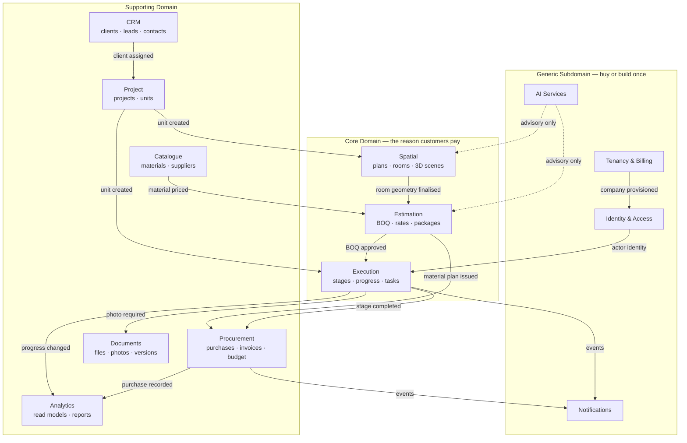
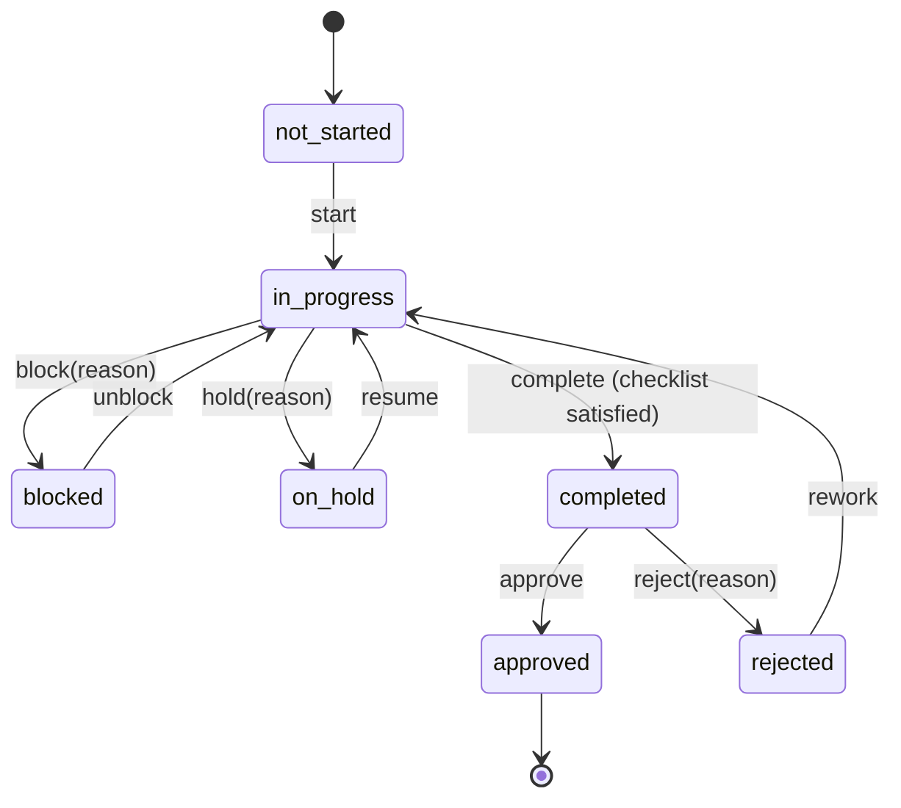
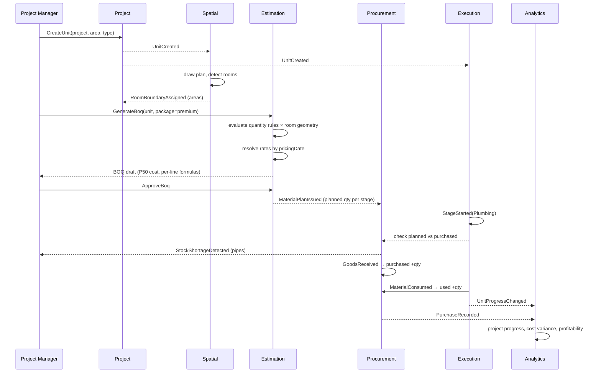

# 02 — Domain Model & Bounded Contexts

This document is the source of truth for the **ubiquitous language**. Every class name, table
name, API path, and UI label must trace back to a term defined here. Where the business says
"stage", the code says `Stage` — never `Phase`, `Step`, or `Task`.

---

## 1. Strategic design — context map

BuildFlow is decomposed into 13 bounded contexts. Each owns its data, exposes a published
interface, and communicates with others through domain/integration events.



### 1.1 Context relationships

| Upstream | Downstream | Pattern | Note |
|---|---|---|---|
| Tenancy | All | **Shared Kernel** (`CompanyId`) | Every aggregate carries the tenant identity |
| IAM | All | **Conformist** | Downstream accepts IAM's `UserId` and permission model as-is |
| Project | Execution, Spatial, Estimation | **Customer/Supplier** | Project publishes `UnitCreated`; downstreams react |
| Spatial | Estimation | **Customer/Supplier** | Room geometry drives quantity take-off |
| Catalogue | Estimation, Procurement | **Published Language** | `MaterialRef` DTO shared, internals hidden |
| Estimation | Procurement | **Customer/Supplier** | An approved BOQ issues a material plan |
| AI | Estimation, Spatial | **Anti-Corruption Layer** | Provider responses never enter the domain untranslated |
| All | Analytics | **Event-driven projection** | Analytics never queries another context's tables directly |

The **anti-corruption layer around AI is non-negotiable**. LLM providers change response
shapes, deprecate models, and return malformed JSON. The domain must never know that an LLM
exists — it asks an `EstimationAdvisor` port for a `CostEstimate` value object.

---

## 2. Shared kernel

Types every context may depend on. They live in `packages/core` and contain no I/O.

| Type | Definition | Rules |
|---|---|---|
| `CompanyId`, `UserId`, `ProjectId`, `UnitId`, … | Branded UUIDv7 wrappers | Never a bare `string`; prevents passing a `UnitId` where a `RoomId` is expected |
| `Money` | `{ amount: bigint (minor units), currency: CurrencyCode }` | No floats, ever. Arithmetic across currencies throws |
| `Quantity` | `{ value: Decimal, uom: UnitOfMeasure }` | Conversion only via an explicit `UomConverter` |
| `UnitOfMeasure` | `m` · `m2` · `m3` · `pcs` · `box` · `kg` · `litre` · `bag` · `roll` · `set` · `man_day` | Conversions require a material-specific factor (a box of tiles is not a universal 1.44 m²) |
| `Percentage` | 0–100 `Decimal` | Clamped at construction |
| `DateRange` | `{ start, end }` | `end ≥ start` invariant |
| `Dimension` | `{ width, length, height, uom }` | Derives `floorArea`, `wallArea`, `perimeter`, `volume` |
| `Result<T, E>` | Explicit success/failure | Domain never throws for expected failures |
| `DomainEvent` | `{ eventId, occurredAt, companyId, actorId, aggregateId, version, payload }` | Base for every event |
| `AuditStamp` | `{ createdBy, createdAt, updatedBy, updatedAt, deletedBy, deletedAt }` | Embedded in every persistent entity |

**Why `Money` uses `bigint` minor units:** the platform computes BOQ totals over hundreds of
lines with percentage markups and multi-rate VAT. IEEE-754 accumulation error is not acceptable
in a document a client signs.

---

## 3. Tactical design per context

Notation: **(AR)** = aggregate root · **(E)** = entity · **(VO)** = value object.

### 3.1 Tenancy & Billing

| Element | Type | Notes |
|---|---|---|
| `Company` | **AR** | The tenant. Owns `RegionalSettings`, `Branding`, `Subscription` |
| `Branch` | E | Optional sub-organisation for multi-city firms |
| `Subscription` | E | Plan, seats, active-unit quota, storage quota, period |
| `RegionalSettings` | VO | Country, currency, measurement system, tax profile, date format, week start, fiscal year start |
| `TaxProfile` | VO | Rate, label (`VAT` / `ضريبة القيمة المضافة`), registration number, effective range |
| `FeatureFlag` | VO | Per-tenant capability toggles |

**Invariants**
- A `Company` always has exactly one active `Subscription`.
- Quota checks (`activeUnits ≤ plan.unitLimit`) are enforced at `UnitCreated`, not at read time.
- Changing `RegionalSettings.currency` after financial records exist is forbidden — it would
  retroactively reinterpret stored `Money`. A migration workflow is required instead.

**Events:** `CompanyProvisioned` · `SubscriptionChanged` · `QuotaExceeded` · `CompanySuspended`

---

### 3.2 Identity & Access

| Element | Type | Notes |
|---|---|---|
| `User` | **AR** | Belongs to one company (platform staff belong to the system company) |
| `Role` | **AR** | System-defined or tenant-custom; a named set of permissions |
| `Permission` | VO | `resource.action` — e.g. `unit.update`, `purchase.approve`, `cost.view` |
| `Assignment` | E | User ↔ project/unit scope binding — the ABAC dimension |
| `Session` | E | Device, IP, user agent, issued/last-seen, revoked flag |
| `RefreshToken` | E | Hashed, rotating, family-tracked for reuse detection |
| `Invitation` | E | Email/mobile invite with expiry and pre-assigned role |

**Invariants**
- A user has ≥ 1 role.
- The last `company_owner` of a company cannot be deleted or demoted.
- A `client` role user MUST have at least one client linkage, else they can see nothing —
  creation without linkage is rejected.
- Revoking a refresh token revokes its entire family (reuse detection).

**Events:** `UserInvited` · `UserActivated` · `RoleAssigned` · `PermissionDenied` ·
`SuspiciousLoginDetected` · `TokenFamilyRevoked`

---

### 3.3 CRM

| Element | Type | Notes |
|---|---|---|
| `Client` | **AR** | Individual, company, developer, or government |
| `ContactPerson` | E | Many per client, one primary |
| `Lead` | **AR** | Pre-client; converts to `Client` |
| `Interaction` | E | Call, visit, meeting, note — with author and timestamp |
| `ClientIdentity` | VO | National ID / Iqama / CR number, with type and country |

**Invariants**
- `mobile` is unique per company (soft-warn on duplicate at creation, hard-unique after confirm).
- Converting a `Lead` is idempotent — a second conversion returns the existing `ClientId`.
- Deleting a client with active units is rejected; it must be archived instead.

**Events:** `ClientCreated` · `LeadConverted` · `ClientArchived`

---

### 3.4 Project

| Element | Type | Notes |
|---|---|---|
| `Project` | **AR** | The commercial container |
| `Unit` | **AR** | ⚠️ A separate aggregate root, not a child entity — see below |
| `Room` | E | Child of `Unit` |
| `ProjectTeam` | E | Role-scoped member assignments |
| `Contract` | E | Value, milestones, retention, signed date |
| `Location` | VO | Address (AR/EN), city, country, `GeoPoint` |
| `FinishSpec` | VO | Per-room floor/wall/ceiling/skirting/door specification |

> **Why `Unit` is its own aggregate root.** A `Project` may hold 200 units in a tower. Loading
> the project aggregate to update one unit's progress would be catastrophic, and the concurrency
> contention on the project row would serialise the whole site. `Unit` references `ProjectId` by
> identity only. The consistency boundary is the unit — which matches the business rule that
> *each unit is tracked independently*.

**Invariants**
- A `Unit` belongs to exactly one `Project`.
- `Unit.ownerClientId` may differ from `Project.clientId` — this is the multi-owner tower case.
- `unitNumber` is unique within a project.
- `Room.floorArea` is derived; it is only directly writable when no floor plan is linked.
- `Σ room.floorArea ≤ unit.grossArea` — violation produces a warning, not a rejection (corridors,
  wall thickness, and shafts make exact equality unrealistic).
- A `Project` cannot transition to `completed` while any unit is not `completed` or `cancelled`.

**Events:** `ProjectCreated` · `ProjectStatusChanged` · `UnitCreated` · `UnitCloned` ·
`UnitDelivered` · `RoomAdded` · `RoomDimensionsChanged` · `FinishSpecChanged`

---

### 3.5 Spatial (Floor Plans & 3D)

| Element | Type | Notes |
|---|---|---|
| `FloorPlan` | **AR** | One per unit per version; owns the whole geometry graph |
| `PlanRevision` | E | Named, restorable snapshot |
| `Wall` | E | Polyline segment with thickness, height, layer |
| `Opening` | E | Door or window hosted on a wall at an offset |
| `StructuralElement` | E | Column, beam, shaft, obstacle |
| `RoomBoundary` | E | Closed polygon linked to a `RoomId` |
| `Point2D`, `Segment`, `Polygon` | VO | Pure geometry, integer millimetres |
| `SceneConfig` | **AR** | 3D presentation state: materials, lighting, camera bookmarks |
| `PlanLock` | E | Advisory edit lock with owner and expiry |

**Invariants**
- All coordinates are stored as **integer millimetres**, never floats — floating-point drift
  breaks snapping and closed-loop detection.
- An `Opening` must lie entirely within its host wall (`0 ≤ offset` and `offset + width ≤ wallLength`).
- Walls may not have zero length.
- A `RoomBoundary` polygon must be simple (non-self-intersecting) and closed.
- Room boundaries within one plan must not overlap by more than a tolerance.

**Why integer millimetres:** two walls drawn at `1200.0000001` and `1199.9999998` must snap to
the same endpoint. Integer storage makes equality exact and makes closed-loop detection a graph
problem rather than a tolerance problem.

**Events:** `PlanCreated` · `PlanGeometryChanged` · `RoomBoundaryDetected` ·
`RoomBoundaryAssigned` · `PlanRevisionCreated` · `SceneMaterialChanged` · `PlanLockTakenOver`

---

### 3.6 Catalogue

| Element | Type | Notes |
|---|---|---|
| `Material` | **AR** | Catalogue item |
| `MaterialCategory` | E | Self-referencing tree (Flooring → Tiles → Porcelain) |
| `Brand` | E | |
| `Supplier` | **AR** | With contacts, payment terms, rating |
| `SupplierMaterial` | E | Supplier-specific price, lead time, minimum order |
| `UomConversion` | VO | Material-specific factor (1 box = 1.44 m²) |
| `MaterialSpec` | VO | Typed attributes (size, thickness, finish, colour, grade) |
| `FinishingPackage` | **AR** | Versioned tier definition |
| `PackageItem` | E | Room type → material for a given element |

**Invariants**
- A `Material` cannot be deleted once referenced by any BOQ line or stock movement — it is
  deactivated.
- `SupplierMaterial.price` is historised; the effective price on a purchase date is resolved by
  date, never overwritten.
- A `FinishingPackage` version becomes immutable once applied to any unit.
- Package price per m² is a derived projection, recomputed on catalogue price change events.

**Events:** `MaterialCreated` · `MaterialPriceChanged` · `MaterialDeactivated` ·
`PackagePublished` · `SupplierRated`

---

### 3.7 Estimation (BOQ)

| Element | Type | Notes |
|---|---|---|
| `Boq` | **AR** | Versioned bill of quantities for one unit |
| `BoqSection` | E | Usually maps to a workflow stage |
| `BoqLine` | E | Item, quantity, rates, totals, source, formula |
| `QuantityRule` | **AR** | Declarative take-off rule |
| `RateCard` | **AR** | Regional/tenant rates with effective dating |
| `Quotation` | **AR** | Client-facing document derived from a BOQ |
| `CostEstimate` | VO | P10/P50/P90 with basis and confidence |

**Invariants**
- A `Boq` in status `approved` is immutable; edits create a new version.
- Every `BoqLine` records `source ∈ {rule, ai, manual}` and, for `rule`, the evaluated formula
  string and its inputs — auditability of quantities is a contractual requirement.
- Rates are resolved by the BOQ's `pricingDate`, never by "now".
- `lineTotal = quantity × (materialRate + labourRate)`; the aggregate recomputes rather than
  trusting a client-supplied total.

**The quantity rule engine** is deliberately declarative data, not code:

```
floor_tiles.quantity   = room.floorArea × (1 + waste.tiles)
wall_paint.quantity    = room.wallArea × coats.paint × (1 + waste.paint)
skirting.quantity      = room.perimeter − Σ(door.width) × (1 + waste.skirting)
gypsum_ceiling.quantity= room.ceilingArea  where room.ceilingType = 'gypsum'
electrical_points.qty  = room.type → pointsPerRoomType[room.type]
plumbing_points.qty    = room.type ∈ {bathroom, kitchen, laundry} → fixtureMatrix[room.type]
```

Rules are per-tenant overridable rows, versioned, with a unit-tested evaluator. This is what
makes the BOQ defensible in front of a client — and what keeps the AI honest, since the AI's job
is to suggest *factors*, not to invent *quantities*.

**Events:** `BoqGenerated` · `BoqLineOverridden` · `BoqApproved` · `BoqVersioned` ·
`MaterialPlanIssued` · `QuotationSent`

---

### 3.8 Execution (Workflow & Progress)

| Element | Type | Notes |
|---|---|---|
| `WorkflowTemplate` | **AR** | Tenant-defined stage sequence with weights |
| `UnitWorkflow` | **AR** | Instantiated per unit; owns its stages |
| `UnitStage` | E | Status, dates, progress, assignee, checklist |
| `StageDependency` | VO | Predecessor + type (FS/SS/FF) + lag |
| `Task` | E | Sub-task within a stage |
| `ChecklistItem` | E | Mandatory or optional completion gate |
| `Crew` | **AR** | Team/subcontractor with trade and members |
| `ProgressSnapshot` | E | Daily materialised progress for trend charts |
| `Snag` | **AR** | Defect with photo evidence and rectification lifecycle |

**Stage state machine**



**Invariants**
- `progress ∈ [0,100]`; `completed` forces 100; `not_started` forces 0.
- `actualStart` is set on the first transition to `in_progress` and never overwritten.
- A stage cannot be `completed` while a mandatory checklist item is unsatisfied.
- Approval requires a different actor than the completer (segregation of duty), unless the
  tenant explicitly disables this.
- Starting a stage whose predecessor is incomplete raises a `StageStartedOutOfSequence` warning
  event — recorded, surfaced, but not blocked. Real sites overlap trades and a system that
  forbids it will simply be bypassed.
- `UnitWorkflow` recomputes unit progress on any stage change and publishes it.

**Events:** `WorkflowInstantiated` · `StageStarted` · `StageProgressUpdated` · `StageBlocked` ·
`StageCompleted` · `StageApproved` · `StageRejected` · `StageStartedOutOfSequence` ·
`UnitProgressChanged` · `DelayDetected` · `SnagRaised` · `SnagClosed`

---

### 3.9 Procurement & Cost

| Element | Type | Notes |
|---|---|---|
| `PurchaseRequest` | **AR** | Optional approval-gated request |
| `PurchaseOrder` | **AR** | Issued to a supplier |
| `GoodsReceipt` | **AR** | Physical receipt; posts `purchased` movements |
| `Invoice` | **AR** | Supplier invoice with attachments and tax |
| `StockMovement` | E | **Immutable** ledger entry |
| `MaterialBalance` | VO | Projection: planned / purchased / used / remaining |
| `Budget` | **AR** | Baseline per unit and per stage |
| `CostAllocation` | VO | Splits one purchase across units/stages |

**Invariants**
- `StockMovement` is append-only. Corrections are reversing entries, never updates or deletes.
- `remaining = Σ(inbound) − Σ(outbound)` and can never be computed by mutating a counter.
- `remaining` may not go negative without an explicit `negative_stock_allowed` tenant flag.
- A `CostAllocation` must sum to exactly the purchase total (to the minor unit) — the remainder
  from percentage splits is assigned to the largest allocation deterministically.
- An `Invoice` cannot be deleted after payment; it is voided with a reason.

**Movement types:** `purchase_receipt` · `consumption` · `return_to_supplier` ·
`transfer_in` · `transfer_out` · `wastage` · `adjustment` · `opening_balance`

**Why an immutable ledger:** the single biggest operational loss in finishing work is unexplained
material shrinkage. A mutable `quantity_used` column cannot answer "who changed it, when, and
from what". A movement ledger can, and it makes the four headline numbers a *derived projection*
that is always reconcilable.

**Events:** `PurchaseRequested` · `PurchaseApproved` · `GoodsReceived` · `MaterialConsumed` ·
`MaterialWasted` · `StockShortageDetected` · `BudgetExceeded` · `InvoiceRecorded`

---

### 3.10 Documents & Media

| Element | Type | Notes |
|---|---|---|
| `Document` | **AR** | Logical document with many versions |
| `DocumentVersion` | E | One stored object, immutable |
| `StoredObject` | VO | Storage key, bytes, checksum, MIME, scan status |
| `Photo` | **AR** | Specialised document with capture metadata |
| `PhotoAnnotation` | E | Non-destructive overlay |
| `Comment` | E | Threaded, with mentions |
| `AccessGrant` | VO | Explicit share beyond role rules |

**Invariants**
- A version is immutable once `scan_status = clean`; re-upload creates version N+1.
- No object is downloadable while `scan_status ∈ {pending, infected}`.
- Deleting a document soft-deletes the logical record; physical objects are purged by a
  retention job after the configured window.
- Every download issues a time-limited signed URL; storage buckets are never public.

**Events:** `DocumentUploaded` · `VersionCreated` · `ScanCompleted` · `ScanFailed` ·
`DocumentShared` · `DocumentDeleted`

---

### 3.11 AI Services

| Element | Type | Notes |
|---|---|---|
| `AiRequest` | **AR** | Recorded invocation: type, inputs, prompt version, cost, latency |
| `AiSuggestion` | **AR** | The output the user accepts/edits/rejects |
| `DesignBrief` | VO | Parsed structured brief from free text |
| `StyleRecommendation` | VO | Style + palette + lighting + furniture direction |
| `AiFeedback` | E | Accepted / edited / rejected + the user's final values |

**Invariants**
- An `AiSuggestion` never mutates a domain aggregate. It produces a draft that a user applies
  through the normal domain command, which is fully validated.
- Every request records `promptVersion` and `modelId` so behaviour changes are attributable.
- Per-tenant token budgets are enforced before dispatch, not after.
- Provider responses pass through a schema validator; malformed output is retried once, then
  degrades to the deterministic rule engine.

**Events:** `AiSuggestionGenerated` · `AiSuggestionAccepted` · `AiSuggestionRejected` ·
`AiQuotaExceeded` · `AiProviderDegraded`

---

### 3.12 Analytics & Reporting

Read-only context. Owns no write model; subscribes to events from every other context and
maintains denormalised projections (`unit_progress_view`, `cost_summary_view`,
`material_consumption_view`, `delay_view`, `profitability_view`).

**Rule:** Analytics never joins across another context's tables. If it needs data, that data
arrives as an event and is projected into an Analytics-owned table. This is the constraint that
makes future service extraction possible without a rewrite.

---

### 3.13 Notifications

| Element | Type |
|---|---|
| `NotificationTemplate` | **AR** — per event type, per channel, per language |
| `NotificationPreference` | E — per user, per event, per channel |
| `Notification` | **AR** — an instance with delivery state |

Channels: in-app · email · SMS · push · WhatsApp (Phase 6). Delivery is queued with retry and
backoff; failure never blocks the originating command.

---

## 4. Cross-context event flow — the central chain



---

## 5. Aggregate design rules

These rules are enforced in code review and by architecture tests.

1. **One aggregate per transaction.** A command modifies exactly one aggregate root. Multi-
   aggregate consistency is achieved through events and, where atomicity matters, the outbox
   pattern.
2. **Reference other aggregates by identity only.** `Unit` holds a `ProjectId`, never a
   `Project` object.
3. **Aggregates are small.** If loading an aggregate pulls more than ~100 rows, it is wrong.
   `Project` deliberately does not contain `Unit`; `UnitWorkflow` deliberately does not contain
   photos.
4. **Invariants live inside the aggregate.** No service reaches in to validate what the
   aggregate should protect.
5. **Optimistic concurrency everywhere.** Every aggregate row carries a `version` column;
   concurrent writes fail loudly rather than last-write-wins. Field crews on flaky connections
   generate concurrent writes constantly.
6. **Events are facts in the past tense** and are immutable once published.
7. **Eventual consistency is a product decision, not an accident.** Where the business needs
   immediate consistency (stock cannot go negative), the check lives inside one aggregate.

---

## 6. Consistency boundaries — worked example

*"A site engineer records 40 m² of tiles consumed on the Flooring stage of unit 305."*

| Step | Aggregate | Consistency |
|---|---|---|
| Validate the engineer is assigned to unit 305 | IAM `Assignment` | Read, cached 60 s |
| Append `consumption` movement | Procurement `StockMovement` | **Strong** — same transaction as the balance check |
| Reject if it would drive remaining < 0 | Procurement `MaterialBalance` | **Strong** — same aggregate |
| Update Flooring stage progress | Execution `UnitStage` | **Strong** — separate transaction, separate command |
| Recompute unit progress | Execution `UnitWorkflow` | **Strong** within Execution |
| Recompute project progress | Analytics projection | **Eventual** (seconds) |
| Notify the PM of budget overrun | Notifications | **Eventual** |
| Update profitability dashboard | Analytics projection | **Eventual** (seconds) |

Everything the engineer can be wrong about in a way that costs money is strongly consistent.
Everything a manager reads on a dashboard is eventually consistent. That split is the design.
