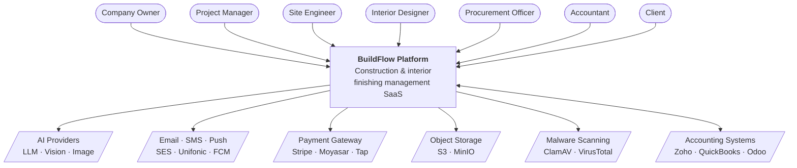
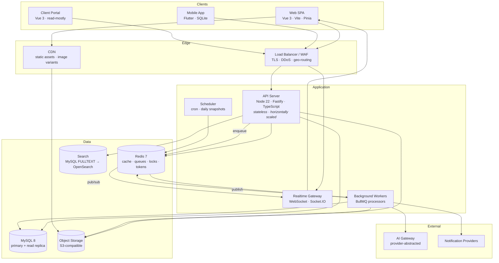
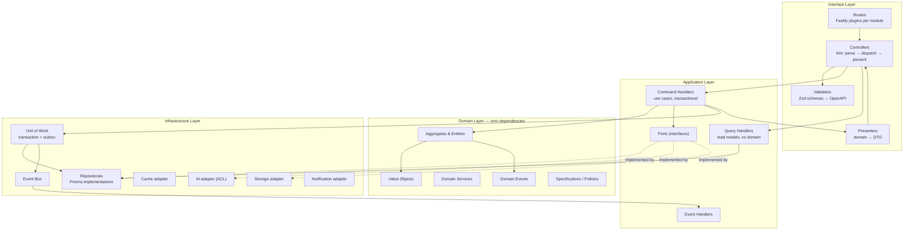
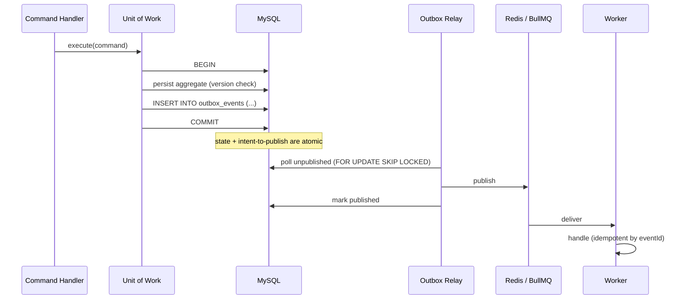
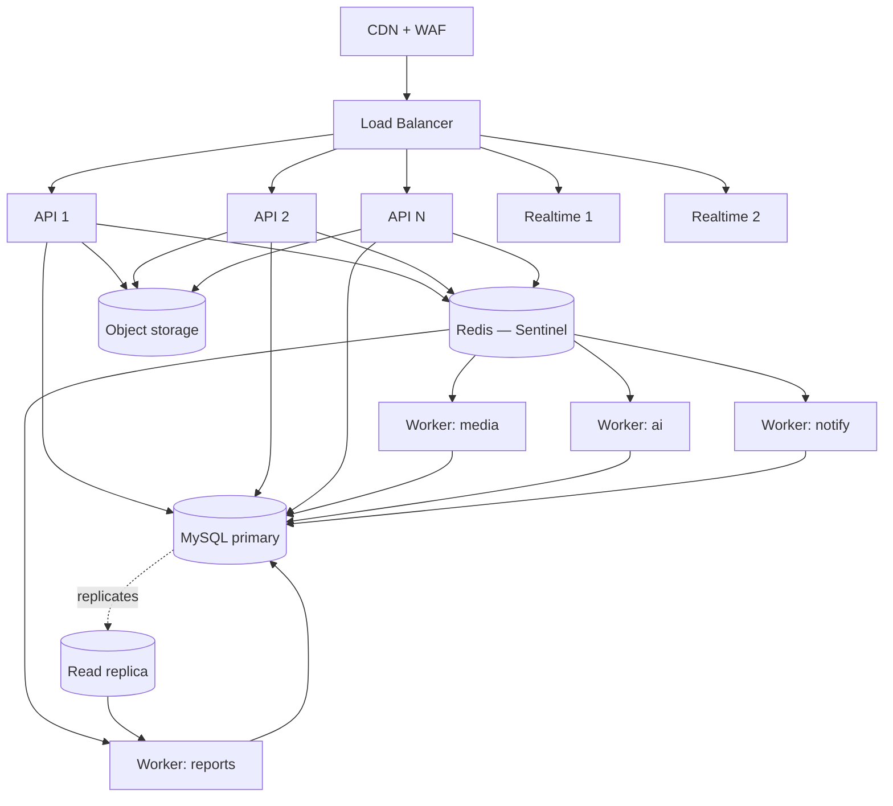

# 03 — System Architecture

---

## 1. Architectural drivers

Every significant decision in this document traces to one of these drivers.

| # | Driver | Consequence |
|---|---|---|
| D1 | Small team, fast time-to-market | Modular monolith, not microservices |
| D2 | Must scale to thousands of projects and hundreds of concurrent users | Stateless API, Redis cache, read projections, object storage |
| D3 | Field users on unreliable connectivity | Offline-first mobile, idempotent write APIs, conflict-aware sync |
| D4 | Multi-country, multi-currency, bilingual RTL | Locale and region as data; translation tables; no baked-in assumptions |
| D5 | Financial and site data must be defensible | Immutable ledgers, full audit trail, event sourcing at the edges |
| D6 | Enterprise buyers demand isolation and residency | Tenant isolation enforced at the data-access layer; per-region deployability; dedicated-DB tier |
| D7 | AI must be optional and cost-bounded | AI behind ports, degraded gracefully, quota-enforced |
| D8 | Heavy client-side compute (2D/3D) | Push geometry work to the browser; server stores geometry, does not render it |

---

## 2. C4 — Level 1: System context



---

## 3. C4 — Level 2: Containers



### 3.1 Container responsibilities

| Container | Responsibility | Scaling |
|---|---|---|
| **API Server** | HTTP request handling, authN/Z, command/query dispatch, validation | Horizontal, stateless; N instances behind LB |
| **Realtime Gateway** | WebSocket fan-out for progress, notifications, plan-lock presence | Horizontal with Redis pub/sub adapter for cross-instance delivery |
| **Workers** | Image processing, PDF/Excel generation, AI calls, notification delivery, projections, virus scanning, exports | Horizontal per queue; independent concurrency per queue class |
| **Scheduler** | Daily progress snapshots, delay detection, quota checks, retention purges, report schedules | Single leader elected via Redis lock |
| **MySQL** | System of record | Vertical first; read replica for analytics/reports at Stage 2 |
| **Redis** | Cache, BullMQ queues, rate-limit counters, refresh-token store, distributed locks, pub/sub | Single → Sentinel → Cluster |
| **Object Storage** | All binary content | Effectively unbounded |

**Why the API never processes images or generates PDFs inline:** a 40-photo upload from a site
engineer would occupy request threads that must stay free for interactive traffic. All CPU-heavy
work is enqueued and acknowledged immediately.

---

## 4. C4 — Level 3: Inside the API server



**The dependency rule:** arrows point inward. `domain/` has zero imports from `application/`,
`infrastructure/`, or `interface/`, and no import of `@prisma/client`, `fastify`, or `ioredis`.
This is verified in CI by `dependency-cruiser`; a violating PR fails the build.

---

## 5. Multi-tenancy strategy

### 5.1 The decision

**Shared database, shared schema, mandatory row-level tenant scoping**, with an **optional
dedicated database per tenant** for the Enterprise tier.

| Model | Isolation | Cost/tenant | Ops burden | Cross-tenant analytics | Verdict |
|---|---|---|---|---|---|
| Database per tenant | Excellent | High | Migration × N tenants | Painful | Enterprise tier only |
| Schema per tenant | Good | Medium | Migration × N schemas | Painful | Rejected — MySQL schema = database, same problem |
| **Shared schema + `company_id`** | Enforced in code | Low | One migration | Trivial | **Chosen for Starter → Business** |

The trap in shared-schema is a developer forgetting `WHERE company_id = ?` exactly once. The
architecture removes that possibility rather than relying on discipline.

### 5.2 Enforcement — three independent layers

**Layer 1 — request context.** A Fastify `onRequest` hook resolves the tenant from the JWT
(`companyId` claim) and stores it in `AsyncLocalStorage`. No handler receives `companyId` as a
parameter it might forget to pass on.

```
JWT → verify → { userId, companyId, roles, permissions }
    → AsyncLocalStorage.run(context, handler)
```

**Layer 2 — Prisma client extension.** Every query is intercepted:

- `findMany` / `findFirst` / `count` / `aggregate` → injects `where.companyId`
- `create` / `createMany` → injects `data.companyId`
- `update` / `delete` → the `where` is rewritten to a compound that includes `companyId`
- Raw queries are **forbidden by lint rule**; the two audited exceptions live in a single
  reviewed file and take `companyId` as the first bound parameter.
- Models in a `GLOBAL_MODELS` allow-list (countries, currencies, global material seed catalogue)
  bypass injection explicitly.

If the ALS context is absent, the extension **throws** rather than returning unscoped data. A
missing tenant context is a bug, not a licence to read everything.

**Layer 3 — data-layer assertion in tests.** An integration test suite seeds two companies and
asserts that every repository method returns nothing for the other tenant. New repositories
without such a test fail a coverage gate.

### 5.3 Tenant identity in the schema

Every tenant-owned table carries `company_id CHAR(36) NOT NULL`, and **every index is
tenant-prefixed** — `(company_id, project_id, status)` rather than `(project_id, status)`. This
matters as much for performance as for correctness: it keeps each tenant's working set
contiguous in the index and stops one large tenant from evicting everyone else's pages.

### 5.4 Enterprise dedicated-database tier

The routing indirection is designed in from day one even though it is not used until Phase 7:

```
request → resolve company → TenantConnectionRegistry.get(companyId)
    → default pool  (shared DB)     for Starter/Professional/Business
    → dedicated pool (tenant_xxx DB) for Enterprise
```

Application code is identical in both modes because it only ever asks the registry for a client.
Migrations run against the shared database plus each registered dedicated database, tracked in a
`tenant_migration_state` table so a partial rollout is resumable.

### 5.5 Noisy-neighbour protection

- Per-tenant rate limits (requests/min, uploads/hour, AI tokens/day, export jobs/hour).
- Queue fairness: jobs carry `companyId`; a per-tenant concurrency cap prevents one tenant's
  5,000-photo import from starving everyone else's notifications.
- Query timeouts (`max_execution_time`) on all read paths.
- Per-tenant slow-query and storage-usage metrics with alerting.

---

## 6. Modular monolith — module boundaries

```
packages/modules/
├── tenancy/          ├── identity/       ├── crm/
├── project/          ├── spatial/        ├── catalogue/
├── estimation/       ├── execution/      ├── procurement/
├── documents/        ├── ai/             ├── analytics/
└── notifications/
```

Each module has an identical internal shape:

```
<module>/
├── domain/          # aggregates, VOs, domain services, events, ports
├── application/     # command handlers, query handlers, event handlers, DTOs
├── infrastructure/  # Prisma repositories, adapters, mappers
├── interface/       # Fastify routes, controllers, request/response schemas
├── module.ts        # registration: DI bindings, routes, subscriptions
└── index.ts         # PUBLIC CONTRACT — the only legal import surface
```

### 6.1 The inter-module rule

```ts
// ❌ fails CI
import { UnitEntity } from '@buildflow/modules/project/domain/unit'

// ✅ legal
import { ProjectApi, UnitSummaryDto } from '@buildflow/modules/project'
```

`index.ts` exports only: DTOs, a read-facing `*Api` interface, event type definitions, and the
module registration function. Aggregates, repositories, and Prisma models are never exported.
`dependency-cruiser` enforces this, and the allowed dependency graph is declared explicitly so
an accidental cycle (e.g. `catalogue → execution`) fails the build.

### 6.2 Why not microservices on day one

Thirteen services would multiply, on day one: deployment pipelines, network failure modes,
distributed transactions, tracing complexity, local-dev friction, and infrastructure cost — in
exchange for scaling that this workload does not yet need. A single API instance handles the
projected Year-1 load with headroom.

What we buy instead: the module boundaries, published contracts, and event-based communication
that make extraction *mechanical* when a real bottleneck appears. The realistic extraction
order is documented in [17 — Scalability](17-scalability.md): **AI Services** first (different
scaling and cost profile), then **Documents/Media** (CPU-bound image work), then **Analytics**
(read-heavy, different storage engine).

---

## 7. CQRS application

CQRS is applied **selectively**, not dogmatically.

| Path | Model | When |
|---|---|---|
| **Commands** | Full domain: load aggregate → invoke behaviour → persist → publish events | Every write |
| **Simple queries** | Repository → DTO, no aggregate hydration | Detail and list screens |
| **Complex queries** | Dedicated query handlers hitting denormalised projections | Dashboards, reports, analytics |

Read and write share one database until Stage 3, at which point read queries move to a replica
and the heaviest dashboards move to projection tables maintained by event handlers. The code
does not change — only the connection the query handler is given.

**What we deliberately do not do:** separate event-sourced write stores for every aggregate.
Event sourcing is applied only where the business genuinely needs a ledger — `StockMovement`,
`AuditLog`, `ProgressSnapshot`, and stage transitions. Everywhere else, state-based persistence
with an outbox is simpler and sufficient.

---

## 8. Event-driven architecture

### 8.1 Two tiers of events

| Tier | Scope | Transport | Delivery |
|---|---|---|---|
| **Domain events** | Within a module | In-process bus, same transaction | Synchronous, all-or-nothing |
| **Integration events** | Across modules / external | Transactional outbox → Redis Streams → BullMQ | At-least-once, async, retried |

### 8.2 The transactional outbox

The classic failure — the database commit succeeds and the queue publish fails, so a stage is
marked complete but nobody is ever notified — is eliminated:



Consumers are **idempotent by `eventId`**, recorded in a `processed_events` table, because
at-least-once delivery guarantees duplicates eventually.

### 8.3 Representative subscriptions

| Event | Consumers |
|---|---|
| `StageCompleted` | Recompute unit progress · notify PM · check next-stage material readiness · audit |
| `UnitProgressChanged` | Project progress projection · client portal push · analytics |
| `GoodsReceived` | Update material balance projection · budget check · supplier stats |
| `BoqApproved` | Issue material plan · create budget baseline · generate quotation draft |
| `PhotoUploaded` | Thumbnail generation · EXIF extraction · virus scan · storage-quota metering |
| `DelayDetected` | Notify PM and owner · risk register · weekly digest |
| `BudgetExceeded` | Notify owner + accountant · flag unit · block further POs if policy set |

---

## 9. Deployment topology

### 9.1 Stage 1 — launch (0–50 tenants)

One VPS or small cloud instance: Docker Compose running API, worker, MySQL, Redis, MinIO,
Caddy/Nginx with TLS. Nightly backup to off-site object storage. Cost: ~$80–150/month.

### 9.2 Stage 2 — growth (50–300 tenants)



Managed MySQL with automated backups and PITR, managed Redis, S3 + CloudFront, autoscaled
API containers, worker pools separated by queue class so a slow AI job never delays a push
notification.

### 9.3 Stage 3 — scale / multi-region

Region-pinned deployments (`me-south-1` for KSA residency, `me-central-1` for UAE, `eu-*` for
overflow). Tenants are routed to their home region by a global tenant directory. Cross-region
data movement is prohibited by policy for regulated tenants.

### 9.4 Environments

| Env | Purpose | Data |
|---|---|---|
| `local` | Docker Compose, seeded fixtures | Synthetic |
| `ci` | Ephemeral per-PR: MySQL + Redis containers | Synthetic |
| `staging` | Pre-production, identical topology | Anonymised production subset |
| `production` | Live | Real |
| `sandbox` | Customer trials & demos, reset weekly | Rich demo tenant |

---

## 10. Observability

| Concern | Tool | Requirement |
|---|---|---|
| Structured logging | Pino → Loki / CloudWatch | Every log carries `requestId`, `companyId`, `userId`, `module` |
| Metrics | Prometheus + Grafana | RED per endpoint, queue depth/latency, DB pool saturation, cache hit rate, AI spend per tenant |
| Tracing | OpenTelemetry | Trace propagates HTTP → command → repository → queue → worker |
| Errors | Sentry | Release-tagged, source-mapped, tenant-tagged |
| Uptime | External synthetic checks | Login flow + critical read path, every 60 s |
| Audit | Application `audit_log` table | Separate from technical logs; queryable by tenants |

**Never logged:** passwords, tokens, national IDs, full file contents, or full request bodies on
auth routes. A Pino redaction list is applied globally and unit-tested.

### 10.1 Alerting thresholds

| Alert | Threshold | Severity |
|---|---|---|
| API 5xx rate | > 1 % over 5 min | Page |
| p95 latency | > 1 s over 10 min | Page |
| Queue depth | > 10,000 or oldest job > 15 min | Page |
| DB connection pool | > 85 % saturated | Warn |
| Replication lag | > 30 s | Warn |
| Failed logins for one account | > 10 in 5 min | Security warn |
| AI spend | > 120 % of daily budget | Warn |
| Storage growth | > 150 % of 7-day trend | Warn |

---

## 11. Technology decisions and their alternatives

| Decision | Chosen | Rejected | Reasoning |
|---|---|---|---|
| HTTP framework | Fastify | Express, NestJS | Express lacks schema-first validation and is slower. NestJS imposes its own DI/module system that fights a hand-rolled clean architecture and adds decorator magic over the domain. Fastify gives encapsulated plugins, JSON-schema validation, and generated OpenAPI without owning the architecture |
| ORM | Prisma | TypeORM, Drizzle, Knex | Prisma's client extensions are the mechanism that makes tenant scoping impossible to forget. Best-in-class migrations and type safety. Drizzle is leaner but lacks an equivalent global interception point |
| Database | MySQL 8 | PostgreSQL | Requirement-mandated. Mitigations for what Postgres would have given us: no native RLS → enforced in the Prisma extension; weaker JSON → typed columns for anything queried; no `NUMERIC` ergonomics → `DECIMAL` + `bigint` minor units |
| Queue | BullMQ on Redis | RabbitMQ, SQS, Kafka | Redis is already required for caching and rate limiting; BullMQ gives retries, backoff, priorities, repeatables, and a UI with no extra infrastructure. Kafka is unjustified at this volume |
| 2D canvas | Konva.js | Fabric.js, raw canvas, SVG | Konva's scene graph, hit detection, transformers, and layer model are exactly what a floor planner needs. SVG DOM degrades badly past ~1,000 nodes |
| 3D | Three.js | Babylon.js | Larger ecosystem, better glTF tooling, lighter for a viewer-only use case |
| Mobile | Flutter | React Native, PWA | A PWA cannot deliver reliable background upload and camera behaviour on iOS. Flutter gives one codebase, excellent offline SQLite integration, and genuine RTL support |
| State | Pinia | Vuex, TanStack Query only | Pinia for client/domain state, TanStack Query for server cache — different problems, both used |
| Auth | Self-hosted JWT + rotating refresh | Auth0, Cognito | Per-tenant custom roles, offline mobile tokens, and data-residency rules make a hosted IdP expensive and constraining. SAML/OIDC SSO is added in Phase 6 for enterprise buyers only |
| IDs | UUIDv7 | Auto-increment, UUIDv4, ULID | Auto-increment leaks tenant volume and breaks offline-generated IDs. UUIDv4 destroys InnoDB clustered-index locality. UUIDv7 is time-ordered — insert locality plus offline generation |

---

## 12. Offline-first write contract

Because mobile clients generate writes without connectivity, every mutating endpoint obeys:

1. **Client-generated IDs.** The mobile app mints UUIDv7 primary keys locally. The server accepts
   the client's ID rather than assigning one, so an offline-created record keeps its identity
   after sync.
2. **Idempotency keys.** Every mutation carries `Idempotency-Key`. The server caches
   `(companyId, key) → response` in Redis for 24 h and replays the stored response on retry.
   A flaky uplink must never create two purchases.
3. **Vector-free conflict handling.** Each aggregate carries a `version`. A stale write returns
   `409` with the current server state; the client resolves per documented policy
   (see [09 — Mobile](09-mobile-architecture.md#5-conflict-resolution)).
4. **Append-only where possible.** Photos, comments, and stock movements are appends — they can
   never conflict. This is why the material model is a ledger: it makes the hardest offline case
   trivially mergeable.

---

## 13. Failure modes and degradation

| Failure | Blast radius | Behaviour |
|---|---|---|
| AI provider down | AI suggestions only | Deterministic rules serve BOQ/estimates; UI shows "AI unavailable" |
| Redis down | Cache + queues | API serves from DB (degraded latency); writes still commit; outbox drains when Redis returns — **no data loss** |
| Object storage down | Uploads/downloads | Uploads queue client-side; existing signed URLs still work; app remains usable |
| Read replica lag | Reports/dashboards | Reads fall back to primary above a lag threshold |
| Worker pool down | Async work | Jobs accumulate in Redis and process on recovery; interactive paths unaffected |
| MySQL primary down | Everything | Failover to standby; RTO ≤ 4 h, RPO ≤ 15 min |
| One tenant floods the API | That tenant only | Per-tenant rate limits and queue concurrency caps contain it |

The consistent principle: **a failure in an optional subsystem must never block a site engineer
from recording what happened on site today.**
