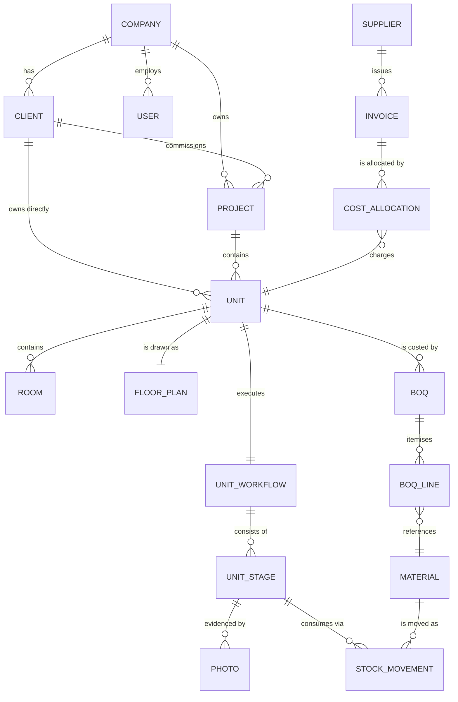
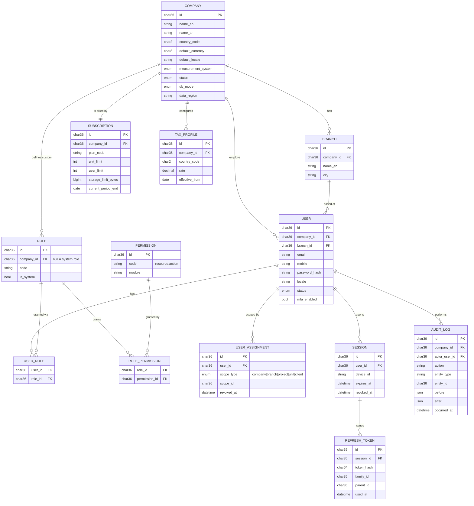
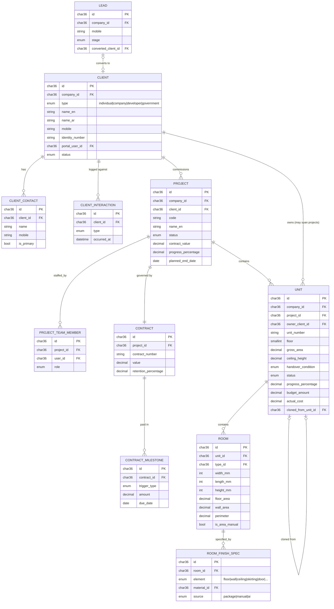
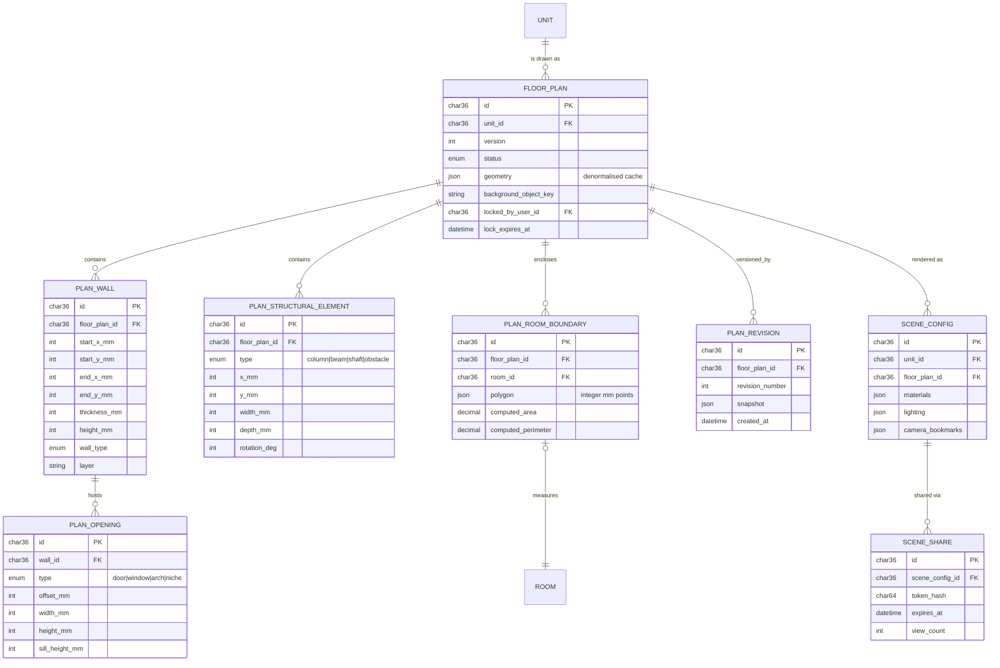
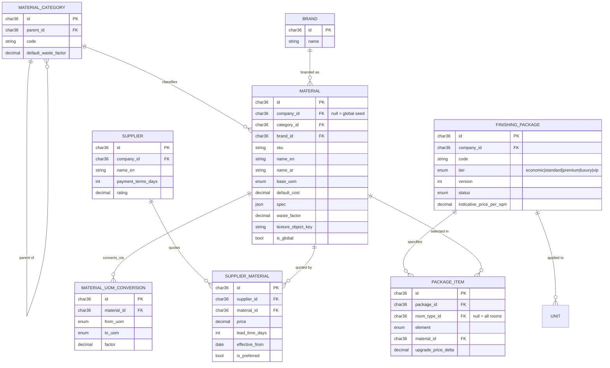
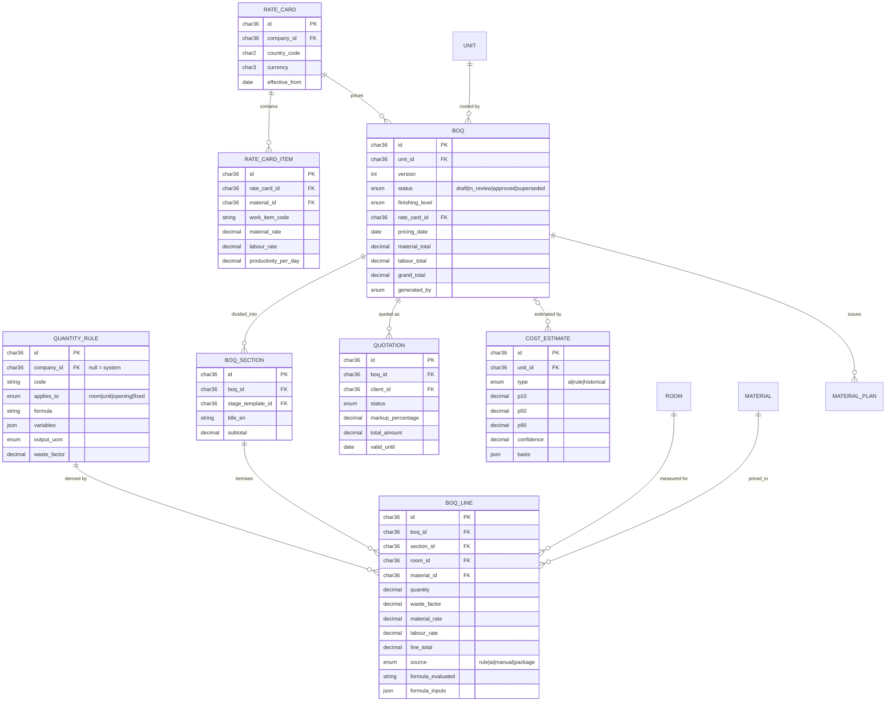
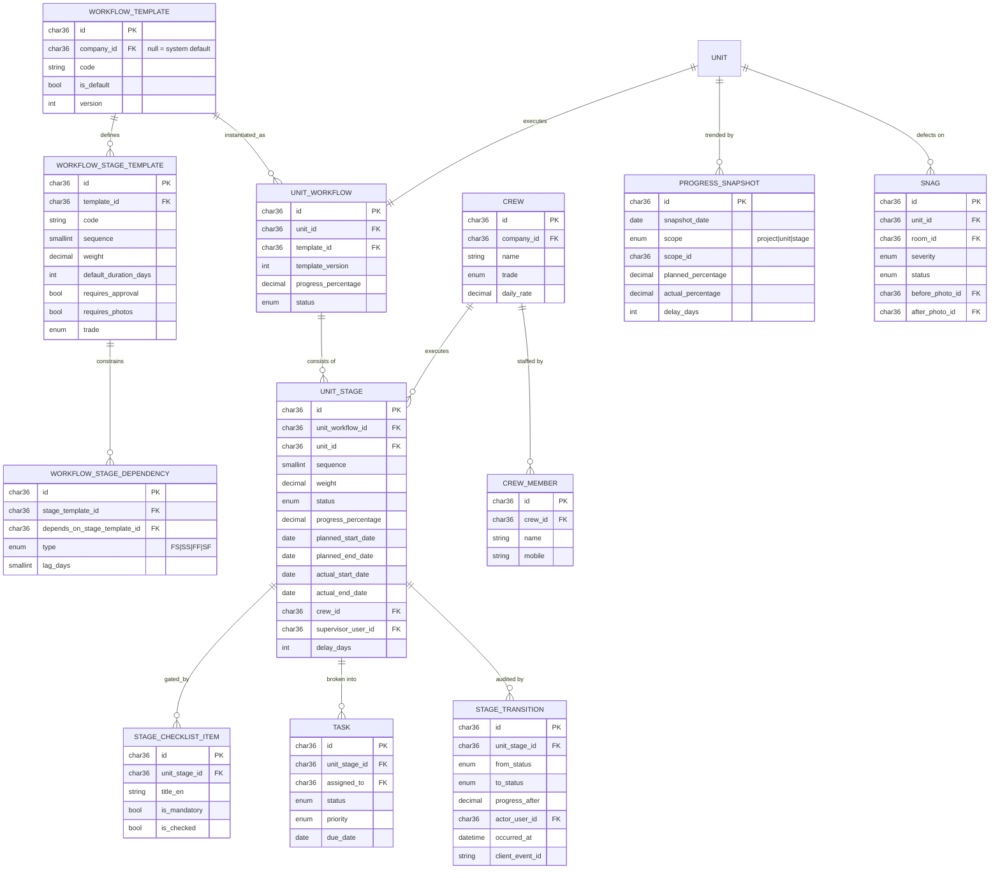
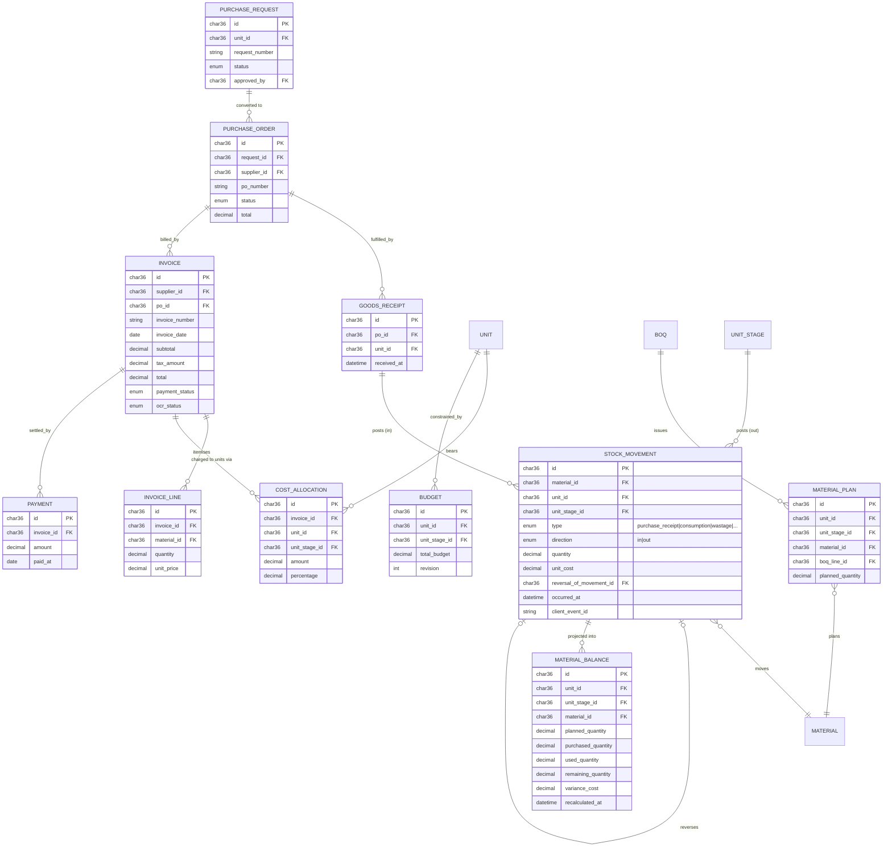
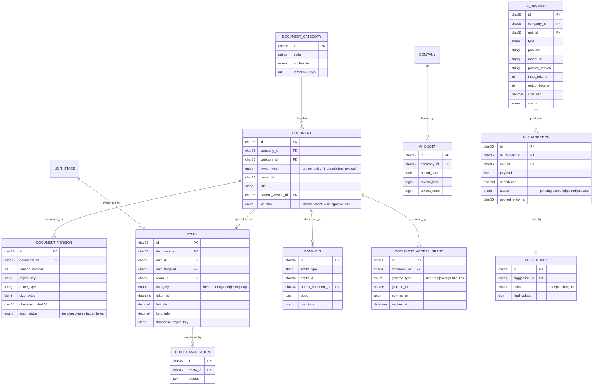
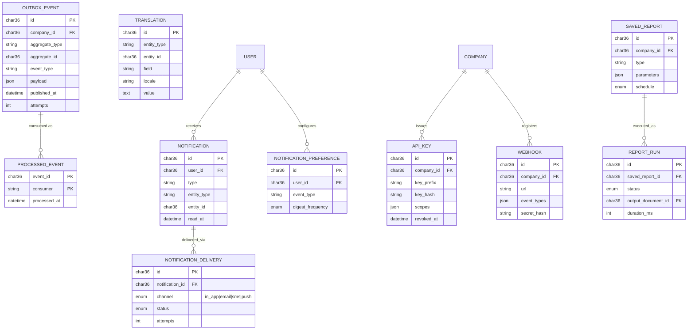

# 05 — Entity Relationship Diagrams

Rendered per bounded context to stay legible. A single diagram of ~90 tables is unreadable and
therefore useless. Attribute lists are abridged to keys and business-significant columns — the
full column set is in [04 — Database Design](04-database-design.md).

---

## 1. Master overview — the spine

The relationship chain that everything else hangs off:

> **Read this diagram once and the product makes sense.** A client owns units; units live in
> projects; a unit is drawn, costed, executed stage by stage, photographed, and paid for — and
> every cost lands back on the unit.

---

## 2. Tenancy & Identity

---

## 3. CRM, Project & Unit

**The multi-ownership rule made concrete:** `UNIT.owner_client_id` is independent of
`PROJECT.client_id`. Ahmed Hassan can own Villa A (its own project), Apartment 101 and 305 (in a
developer's tower project), and Office Unit 12 (in a commercial project) — four units, three
projects, one client, four independently tracked lifecycles.

---

## 4. Spatial

---

## 5. Catalogue & Packages

---

## 6. Estimation & BOQ

---

## 7. Execution

---

## 8. Procurement, Cost & the material ledger

> `MATERIAL_BALANCE` is drawn as derived from `STOCK_MOVEMENT` deliberately. The four headline
> numbers (planned / purchased / used / remaining) are a **projection**, not a source of truth.
> Any of them can be recomputed from the ledger at any time, which is what makes shrinkage
> arguments resolvable.

---

## 9. Documents, Media & AI

---

## 10. Cross-cutting platform tables

---

## 11. Cardinality summary

| Relationship | Cardinality | Enforced by |
|---|---|---|
| Company → Users | 1 : N | FK + tenant scope |
| Company → Clients | 1 : N | FK + tenant scope |
| Client → Projects | 1 : N | FK, nullable (internal projects) |
| **Client → Units** | **1 : N, independent of project** | `units.owner_client_id` FK |
| Project → Units | 1 : N | FK, required |
| Unit → Rooms | 1 : N | FK, cascade within aggregate |
| Unit → FloorPlan | 1 : N versions, 1 active | Partial unique on `status='active'` |
| Unit → UnitWorkflow | 1 : 1 active | Unique `(company_id, unit_id)` where active |
| UnitWorkflow → UnitStages | 1 : N | FK, cascade |
| Unit → BOQ | 1 : N versions | Unique `(unit_id, version)` |
| BOQ → BoqLines | 1 : N | FK, cascade |
| Material ↔ Supplier | M : N, date-effective | `supplier_materials` |
| Material ↔ Unit | M : N through movements | `stock_movements` |
| Invoice ↔ Unit | M : N through allocations | `cost_allocations` |
| UnitStage → Photos | 1 : N | FK |
| Package → Units | 1 : N, versioned | `units.finishing_package_version` pins the version |
