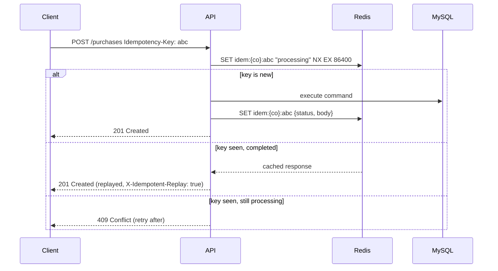

# 07 — API Architecture

---

## 1. Style decision

**REST over HTTP/JSON**, with a small number of RPC-flavoured action endpoints where a resource
verb is genuinely awkward.

| Considered | Verdict |
|---|---|
| **REST** | **Chosen.** Cacheable, universally tooled, trivially consumable from Flutter and Vue, and easy to document with OpenAPI. Fits a resource-shaped domain |
| GraphQL | Rejected for v1. Real benefit for deeply nested client-driven reads, but brings N+1 risk, hard-to-reason rate limiting, complex per-field authorization, and cache invalidation pain. **Reconsidered in Phase 6 as a read-only gateway** if the mobile app's over-fetching becomes measurable |
| gRPC | Rejected. Browser support requires a proxy; no advantage for a public-facing SaaS API |
| tRPC | Rejected. Excellent for a TS-only monorepo, but the Flutter mobile app and future public API need a language-neutral contract |

Action endpoints are used where forcing a resource shape would be dishonest:
`POST /units/{id}/stages/{stageId}/complete` is clearer, and safer to authorize, than
`PATCH /unit-stages/{id}` with a magic body.

---

## 2. Conventions

| Concern | Rule |
|---|---|
| Base URL | `https://api.buildflow.app/api/v1` |
| Versioning | URL path (`/v1`). A new major version runs in parallel; old versions get 12 months' notice |
| Naming | Plural, kebab-case resources: `/purchase-orders`, `/unit-stages` |
| Casing | `camelCase` JSON both directions |
| Dates | ISO 8601 UTC with offset: `2026-08-15T09:30:00.000Z` |
| Money | `{ "amount": "125000.0000", "currency": "SAR" }` — **string** amount, never a JSON number (float precision) |
| Quantities | `{ "value": "48.5000", "uom": "m2" }` |
| IDs | UUIDv7 strings |
| Nulls | Explicit `null` for "no value"; omitted key means "unchanged" in `PATCH` |
| Empty lists | `[]`, never `null` |
| Booleans | `is*` / `has*` / `can*` prefixes |

### 2.1 Standard headers

**Request**

| Header | Purpose |
|---|---|
| `Authorization: Bearer <jwt>` | Access token |
| `Accept-Language: ar-SA` | Response localisation for messages and enum labels |
| `X-Company-Id` | Only when a user belongs to multiple tenants; validated against the token |
| `Idempotency-Key` | **Required on every POST/PUT/PATCH/DELETE** |
| `If-Match` | Aggregate version for optimistic concurrency |
| `X-Client-Version` | `web/2.4.1`, `mobile-ios/1.8.0` — drives minimum-version enforcement |
| `X-Request-Id` | Client-supplied trace correlation (server generates if absent) |

**Response**

| Header | Purpose |
|---|---|
| `X-Request-Id` | Echoed for support correlation |
| `ETag` | Entity version for conditional requests |
| `X-RateLimit-Limit` / `-Remaining` / `-Reset` | Quota state |
| `Retry-After` | On 429 / 503 |
| `Deprecation` / `Sunset` | Advance notice on retiring endpoints |

---

## 3. Response envelope

**Single resource** — the resource is the body; metadata goes in headers:

```json
{
  "id": "018f2a7c-...",
  "unitNumber": "305",
  "grossArea": "142.5000",
  "status": "in_progress",
  "progressPercentage": "68.50",
  "createdAt": "2026-03-01T08:00:00.000Z",
  "version": 7
}
```

**Collection** — data plus pagination and optional aggregates:

```json
{
  "data": [ /* … */ ],
  "meta": {
    "pagination": {
      "limit": 25,
      "nextCursor": "eyJjIjoiMjAyNi0wMy0wMSIsImkiOiIwMThmIn0",
      "prevCursor": null,
      "hasMore": true,
      "totalCount": 1284
    },
    "aggregates": { "totalArea": "18420.0000", "averageProgress": "54.20" }
  }
}
```

`totalCount` is **optional and opt-in** via `?includeTotal=true`. `COUNT(*)` over a large
filtered set is expensive, and most screens do not need it — an infinite-scroll list needs
`hasMore`, not a total.

---

## 4. Pagination, filtering, sorting

### 4.1 Cursor pagination (default)

```
GET /units?limit=25&cursor=eyJjIjoi...
```

Opaque base64 cursor encoding the sort key and tiebreaker ID. Stable under concurrent inserts,
and `O(1)` regardless of depth. Offset pagination is available only where a UI genuinely needs
numbered pages (reports), capped at offset 10,000.

### 4.2 Filtering

```
GET /units?projectId=018f…&status=in_progress,on_hold&progressPercentage[gte]=50
          &plannedEndDate[lte]=2026-12-31&search=305&ownerClientId=018f…
```

Operators: `[eq]` (default) · `[ne]` · `[gt]` · `[gte]` · `[lt]` · `[lte]` · `[in]` ·
`[contains]` · `[between]` · `[isNull]`. Every filterable field is declared per endpoint in a
Zod schema, so an undeclared filter is a 400 — an unbounded filter surface is an unbounded
query-plan surface.

### 4.3 Sorting and sparse fieldsets

```
GET /units?sort=-plannedEndDate,unitNumber&fields=id,unitNumber,status,progressPercentage
GET /units?include=project,ownerClient        # whitelisted relations only
```

`include` depth is capped at 2, and each expansion is a declared, index-backed query — never a
lazy per-row fetch.

---

## 5. Idempotency

Every mutating request carries `Idempotency-Key` (client-generated UUID).



Non-negotiable for the mobile app: a site engineer on a dying connection will retry, and the
system must never create the same purchase, the same consumption movement, or the same stage
completion twice.

---

## 6. Concurrency control

```
GET   /units/018f…          → ETag: "7"
PATCH /units/018f…          → If-Match: "7"
```

- Version matches → apply, return `ETag: "8"`.
- Version stale → `409` with a body containing the **current server state**, so the client can
  present a real diff instead of a useless "someone else changed this" dialog.
- `If-Match` absent on `PATCH` → `428 Precondition Required`.

---

## 7. Endpoint catalogue

### 7.1 Authentication

| Method | Path | Purpose |
|---|---|---|
| POST | `/auth/login` | Email/mobile + password → access + refresh |
| POST | `/auth/refresh` | Rotate refresh token (reuse detection) |
| POST | `/auth/logout` | Revoke the current session |
| POST | `/auth/logout-all` | Revoke every session for the user |
| POST | `/auth/forgot-password` · `/auth/reset-password` | Recovery |
| POST | `/auth/verify-otp` · `/auth/mfa/enable` · `/auth/mfa/verify` | OTP and MFA |
| GET | `/auth/me` | Profile + roles + effective permissions + company settings |
| GET | `/auth/sessions` · DELETE `/auth/sessions/{id}` | Session management |

### 7.2 Tenancy

| Method | Path |
|---|---|
| GET / PATCH | `/company` |
| GET / PATCH | `/company/settings` (locale, currency, units, tax, week start) |
| GET | `/company/subscription` · `/company/usage` |
| GET/POST/PATCH/DELETE | `/branches` |
| GET/POST/PATCH/DELETE | `/users`, `/roles` |
| GET | `/permissions` (catalogue) |
| POST | `/users/{id}/assignments` (project/unit scoping) |
| POST | `/invitations` · POST `/invitations/{token}/accept` |

### 7.3 CRM

| Method | Path |
|---|---|
| GET/POST/PATCH/DELETE | `/clients` |
| GET | `/clients/{id}/projects` · `/clients/{id}/units` · `/clients/{id}/timeline` |
| GET/POST | `/clients/{id}/contacts` · `/clients/{id}/interactions` |
| GET/POST/PATCH | `/leads` · POST `/leads/{id}/convert` |
| POST | `/clients/check-duplicate` |

### 7.4 Projects & Units

| Method | Path |
|---|---|
| GET/POST/PATCH/DELETE | `/projects` |
| POST | `/projects/{id}/status` (validated transition + reason) |
| GET/POST/DELETE | `/projects/{id}/team` |
| GET | `/projects/{id}/summary` (progress, cost, delays — projection-backed) |
| GET/POST | `/projects/{id}/contract` · `/contracts/{id}/milestones` |
| GET/POST/PATCH/DELETE | `/units` |
| POST | `/units/{id}/clone` (rooms + plan + BOQ + workflow) |
| POST | `/units/bulk` (create N units from a floor template) |
| GET | `/units/{id}/overview` (the unit 360 screen, single call) |
| GET/POST/PATCH/DELETE | `/units/{id}/rooms` |
| PUT | `/rooms/{id}/finish-specs` |

### 7.5 Spatial

| Method | Path |
|---|---|
| GET/POST | `/units/{id}/floor-plans` |
| GET | `/floor-plans/{id}` (full geometry, one round trip) |
| PUT | `/floor-plans/{id}/geometry` (whole-scene save, version-checked) |
| PATCH | `/floor-plans/{id}/geometry` (delta ops for autosave) |
| POST | `/floor-plans/{id}/lock` · DELETE `/floor-plans/{id}/lock` · POST `/floor-plans/{id}/lock/takeover` |
| POST | `/floor-plans/{id}/revisions` · POST `/floor-plans/{id}/revisions/{rev}/restore` |
| POST | `/floor-plans/{id}/detect-rooms` (server-side closed-loop detection) |
| POST | `/floor-plans/{id}/export` (PDF/PNG → async job) |
| GET/PUT | `/units/{id}/scene-config` |
| POST | `/scene-configs/{id}/share` (expiring public link) |

### 7.6 Catalogue

| Method | Path |
|---|---|
| GET/POST/PATCH/DELETE | `/materials` · `/material-categories` · `/brands` · `/suppliers` |
| GET | `/materials/search?q=` (FULLTEXT, AR + EN) |
| POST | `/materials/{id}/copy-from-global` |
| POST | `/materials/import` (CSV/Excel → async) |
| GET/POST | `/suppliers/{id}/materials` (date-effective pricing) |
| GET/POST/PATCH | `/finishing-packages` · POST `/finishing-packages/{id}/publish` |
| GET | `/finishing-packages/compare?ids=a,b,c` |

### 7.7 Estimation & BOQ

| Method | Path |
|---|---|
| POST | `/units/{id}/boqs/generate` (async; rules + optional AI) |
| GET | `/units/{id}/boqs` · GET `/boqs/{id}` |
| PATCH | `/boqs/{id}/lines/{lineId}` (override, reason required) |
| POST | `/boqs/{id}/lines` · DELETE `/boqs/{id}/lines/{lineId}` |
| POST | `/boqs/{id}/approve` · POST `/boqs/{id}/duplicate-as-version` |
| GET | `/boqs/{id}/diff?against={otherId}` |
| POST | `/boqs/{id}/export` (Excel/PDF, AR or EN) |
| POST | `/boqs/{id}/quotations` · POST `/quotations/{id}/send` |
| GET/POST/PATCH | `/quantity-rules` · `/rate-cards` |

### 7.8 Execution

| Method | Path |
|---|---|
| GET/POST/PATCH | `/workflow-templates` |
| POST | `/units/{id}/workflow` (instantiate from template) |
| GET | `/units/{id}/stages` (board view) |
| POST | `/units/{id}/stages/{stageId}/start` |
| PATCH | `/units/{id}/stages/{stageId}/progress` |
| POST | `.../complete` · `.../approve` · `.../reject` · `.../block` · `.../hold` · `.../resume` |
| PATCH | `.../assign` (crew + supervisor) |
| GET/POST/PATCH | `/unit-stages/{id}/checklist` · `/unit-stages/{id}/tasks` |
| GET | `/stages/overdue` (company-wide) |
| GET/POST | `/crews` |
| GET/POST/PATCH | `/snags` · POST `/snags/{id}/resolve` · `/snags/{id}/verify` |

### 7.9 Procurement & Cost

| Method | Path |
|---|---|
| GET/POST/PATCH | `/purchase-requests` · POST `/purchase-requests/{id}/approve` |
| GET/POST | `/purchase-orders` · POST `/purchase-orders/{id}/issue` |
| POST | `/goods-receipts` (posts inbound stock movements) |
| GET/POST/PATCH | `/invoices` · POST `/invoices/{id}/allocate` · POST `/invoices/{id}/payments` |
| POST | `/invoices/upload` (file → OCR job → suggestion) |
| GET | `/units/{id}/materials` (planned/purchased/used/remaining) |
| POST | `/units/{id}/materials/consume` (records a consumption movement) |
| POST | `/stock-movements` · POST `/stock-movements/{id}/reverse` |
| GET | `/units/{id}/budget` · `/units/{id}/cost-summary` |
| GET | `/materials/shortages` |

### 7.10 Documents & Media

| Method | Path |
|---|---|
| POST | `/uploads/presign` → `{ uploadUrl, objectKey, expiresAt }` |
| POST | `/documents` (register an uploaded object) |
| GET | `/documents?ownerType=unit_stage&ownerId=…` |
| GET | `/documents/{id}/download` → 302 to a signed URL |
| POST | `/documents/{id}/versions` |
| GET/POST | `/photos` · POST `/photos/batch` |
| PATCH | `/photos/{id}` (caption, category, room) |
| POST | `/photos/{id}/annotations` |
| GET/POST | `/comments?entityType=&entityId=` |

**Uploads never stream through the API.** The client presigns, PUTs directly to object storage,
then registers the object. This keeps large transfers off the application tier entirely.

### 7.11 AI

| Method | Path |
|---|---|
| POST | `/ai/design-brief` (free text → structured brief) |
| POST | `/ai/style-recommendation` |
| POST | `/ai/estimate/materials` · `/ai/estimate/cost` · `/ai/estimate/duration` |
| POST | `/ai/design-suggestions` (layout, finishes, palette, lighting) |
| POST | `/ai/analyze-photo` (progress/quality assessment) |
| POST | `/ai/suggestions/{id}/apply` · `/reject` |
| GET | `/ai/usage` (tenant quota state) |

All AI endpoints are **async**: they return `202 Accepted` with a job ID; the result arrives over
WebSocket or is polled at `/jobs/{id}`. LLM latency (2–30 s) must never occupy an HTTP request
slot or hit a client timeout.

### 7.12 Reporting & Dashboards

| Method | Path |
|---|---|
| GET | `/dashboard/overview` · `/dashboard/projects` · `/dashboard/financial` · `/dashboard/field` |
| POST | `/reports/{type}/run` → 202 + job ID |
| GET | `/reports/runs/{id}` · `/reports/runs/{id}/download` |
| GET/POST/DELETE | `/saved-reports` |

Report types: `project-status` · `material-consumption` · `cost-summary` · `delay-analysis` ·
`supplier-performance` · `client-statement` · `profitability` · `stage-productivity`.

### 7.13 Client portal (separate surface, restricted)

`/portal/*` — a distinct route tree with its own middleware chain, its own rate limits, and a
token audience of `portal`. A portal token is structurally incapable of calling `/api/v1/*`.

| Method | Path |
|---|---|
| GET | `/portal/units` · `/portal/units/{id}/progress` · `/portal/units/{id}/photos` |
| GET | `/portal/units/{id}/documents` · `/portal/quotations/{id}` |
| POST | `/portal/quotations/{id}/respond` · `/portal/stages/{id}/approve` |
| GET | `/portal/scene/{shareToken}` |

Keeping the portal on its own surface means a mistake in a portal handler cannot expose an
internal endpoint. Shared code is shared deliberately; shared routing is not.

---

## 8. Realtime

**Socket.IO over WebSocket**, authenticated with the same access token, with a Redis adapter so
any API instance can deliver to any connected client.

| Room | Members | Events |
|---|---|---|
| `company:{id}` | All company users | `notification.created`, `announcement` |
| `project:{id}` | Assigned team | `project.progress.changed`, `unit.status.changed` |
| `unit:{id}` | Viewers of that unit | `stage.updated`, `photo.uploaded`, `comment.added` |
| `plan:{id}` | Planner editors | `plan.lock.acquired/released`, `plan.presence` |
| `user:{id}` | One user | `job.completed`, `ai.suggestion.ready`, `mention` |

**Fallback:** clients that cannot hold a socket (poor mobile networks, corporate proxies) poll
`GET /events?since={cursor}` every 30 s. Realtime is an enhancement; nothing depends on it.

---

## 9. Rate limiting

| Scope | Limit | Window |
|---|---|---|
| Anonymous / IP | 60 | 1 min |
| `POST /auth/login` per IP | 10 | 15 min |
| `POST /auth/login` per account | 5 | 15 min |
| Authenticated user | 300 | 1 min |
| Company (all users) | 3,000 | 1 min |
| File uploads per user | 200 | 1 h |
| AI endpoints per company | plan-dependent | 1 day |
| Report/export jobs per company | 50 | 1 h |
| API key (server-to-server) | key-configured | 1 min |

Sliding-window counters in Redis. Exceeding a limit returns `429` with `Retry-After` and a
Problem Details body. Limits are per-tenant so one customer's integration cannot degrade another
customer's experience.

---

## 10. OpenAPI & client generation

The OpenAPI 3.1 document is generated from the same Zod schemas the runtime validates against,
so documentation cannot drift from behaviour. Published at `/docs` (Scalar UI) and `/openapi.json`.

Generated automatically in CI:

| Target | Output |
|---|---|
| Web (Vue) | TypeScript types + a typed fetch client |
| Mobile (Flutter) | Dart models + a Dio client |
| Public API | Postman collection + published reference site |

A breaking schema change fails CI unless the version is bumped — the contract is tested, not
just documented.

---

## 11. Webhooks (outbound)

Tenants register endpoints for selected events. Delivery is signed and retried:

```http
POST https://customer.example.com/hooks/buildflow
X-BuildFlow-Event: stage.completed
X-BuildFlow-Delivery: 018f2a…
X-BuildFlow-Signature: t=1755244800,v1=5f3a…      # HMAC-SHA256 over "t.body"
```

Timestamped signatures prevent replay. Retry schedule: 1 m → 5 m → 30 m → 2 h → 12 h, then the
endpoint is auto-disabled and the tenant notified. Delivery history is visible in the UI so a
customer can debug their own integration without a support ticket.

---

## 12. API design rules

1. **Never expose internal IDs of other tenants**, even in error messages.
2. **404, not 403,** for cross-tenant access — a 403 confirms existence.
3. **Every list endpoint is paginated.** There is no unbounded list, ever.
4. **Every mutation is idempotent.**
5. **Long operations return 202 + a job ID.** Nothing user-facing blocks on an LLM, a PDF, or a
   40,000-row export.
6. **Bulk endpoints for field workflows** — a mobile client syncing 40 offline actions makes one
   call, not 40.
7. **Additive changes only within a version.** Adding a field is safe; changing a type is not.
8. **Deprecate with headers and a 12-month sunset**, never with a silent removal.
9. **Localised messages, stable codes.** UIs switch on `code`; humans read `title`.
10. **Permissions are declared on the route**, checked before the handler, and reflected in
    `GET /auth/me` so the UI can hide what the user cannot do.
