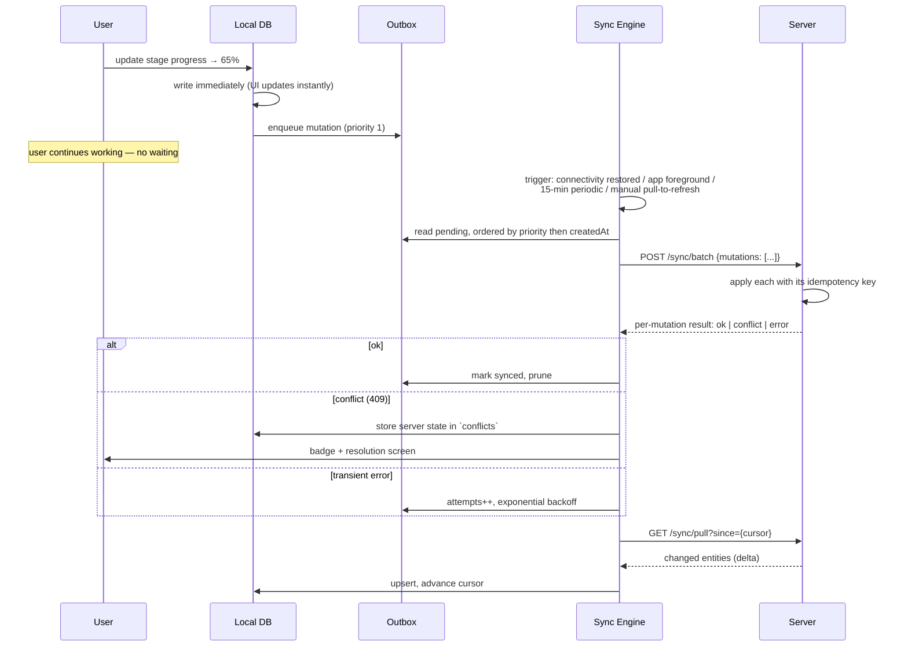

# 09 — Mobile Application Architecture

**Stack:** Flutter 3.x · Dart 3 · Riverpod · Drift (SQLite) · Dio · `workmanager` ·
`flutter_secure_storage` · `camera` + `image` · Firebase Cloud Messaging

---

## 1. Why Flutter, and why not a PWA

| Option | Verdict |
|---|---|
| **Flutter** | **Chosen.** One codebase for iOS + Android, genuine background upload, reliable camera control, excellent SQLite integration via Drift, first-class RTL, 60 FPS on low-end Android — which is what site engineers actually carry |
| PWA | Rejected. iOS Safari has no reliable background sync, restrictive storage quotas that Safari can evict, and awkward camera behaviour. The single most important requirement — "the engineer's photos upload even when the app is backgrounded on a weak connection" — is not deliverable |
| React Native | Viable, but weaker offline-database story and more platform-specific code for camera and background work |
| Native × 2 | Rejected. Two codebases for a small team, for capabilities Flutter already delivers |

**The mobile app is the product's success condition.** If site engineers do not use it, the
database is empty and every other module is decoration. Everything below optimises for one
metric: *the time and friction between "something happened on site" and "it is recorded".*

---

## 2. Design principles

1. **Offline is the default assumption, not the exception.** Red-brick sites are concrete boxes
   in basements. The app must behave identically with the radio off.
2. **Never block the user on the network.** Every action writes locally and returns instantly;
   sync is a background concern the user can observe but never has to wait for.
3. **Never lose field data.** A queued action survives app kill, phone restart, and OS update.
   There is no code path that discards an unsynced write.
4. **Four taps to the daily loop.** Launch → today's unit → stage → update + photos.
5. **Arabic-first.** Designed RTL, then verified LTR — not the reverse.
6. **One-handed, gloved, in sunlight.** Large targets (≥ 48 dp), high contrast, minimal typing,
   voice notes as a first-class input.

---

## 3. Architecture

Clean architecture mirroring the backend, so the same vocabulary applies on both sides:

```
lib/
├── main.dart
├── app/                       # router (go_router), theme, localization, DI
├── core/
│   ├── network/               # Dio client, interceptors, connectivity, retry
│   ├── storage/               # Drift database, secure storage, file cache
│   ├── sync/                  # the sync engine — see §4
│   ├── errors/  utils/  theme/
├── features/
│   ├── auth/
│   ├── units/
│   ├── stages/                # the daily loop
│   ├── photos/
│   ├── materials/
│   ├── invoices/
│   ├── plans/                 # offline raster plan viewer
│   └── notifications/
│       └── each: data/ (dto, local_ds, remote_ds, repository_impl)
│                 domain/ (entity, repository interface, usecase)
│                 presentation/ (screen, widget, controller)
└── l10n/                      # ARB files: app_en.arb, app_ar.arb
```

### 3.1 The repository rule

Every repository reads **local-first**:

```dart
Stream<List<UnitEntity>> watchAssignedUnits() {
  // 1. emit from SQLite immediately — screen renders with zero latency
  // 2. if online, fetch deltas in the background
  // 3. upsert into SQLite → the stream re-emits
  // The UI never knows or cares whether the network was involved
}
```

There is no loading spinner on a screen the user has opened before. The data is already on the
device.

---

## 4. Offline sync engine

### 4.1 Local schema (Drift / SQLite)

| Table | Purpose |
|---|---|
| `units`, `unit_stages`, `rooms`, `materials`, `material_balances` | Mirrored read models for assigned work |
| `photos_local` | Local file path, upload state, target entity, capture metadata |
| `outbox` | **Queued mutations** — the heart of the engine |
| `sync_state` | Per-entity cursor + last successful sync timestamp |
| `conflicts` | Rejected writes awaiting user resolution |
| `attachments_cache` | Downloaded plans and documents with LRU eviction |

### 4.2 The outbox

```dart
class OutboxEntry {
  String id;              // client-generated UUIDv7 — becomes the server record ID
  String idempotencyKey;  // survives every retry
  String entityType;      // unit_stage | photo | stock_movement | invoice | snag
  String entityId;
  String operation;       // create | update | action
  String action;          // e.g. 'complete', 'approve', 'consume'
  String payloadJson;
  int    baseVersion;     // for optimistic concurrency
  int    attempts;
  String status;          // pending | syncing | synced | conflict | failed
  DateTime createdAt;
  String? lastError;
  int  priority;          // stage updates > photos > cached reads
}
```

**Client-generated IDs are the crucial design choice.** The engineer creates a snag offline and
immediately attaches three photos to it. Those photos reference a snag ID that does not yet
exist on the server. Because the client mints the real UUID, no ID remapping is ever needed and
relationships created offline stay intact through sync.

### 4.3 Sync cycle



### 4.4 Batch sync endpoint

Forty offline actions become one HTTP call, not forty:

```json
POST /api/v1/sync/batch
{
  "mutations": [
    { "id": "018f…", "idempotencyKey": "018f…", "entityType": "unit_stage",
      "entityId": "018f…", "action": "updateProgress",
      "payload": { "progressPercentage": "65.00" }, "baseVersion": 4,
      "occurredAt": "2026-08-15T07:12:00.000Z" }
  ]
}
```

The server processes each independently and returns a per-mutation result. **One failure never
fails the batch** — a stale stage update must not prevent twelve photos from registering. Each
mutation carries `occurredAt` from the device so the audit trail records when it *happened*, not
when it *arrived*, while server time remains authoritative for ordering.

### 4.5 Sync triggers

| Trigger | Behaviour |
|---|---|
| Connectivity regained | Immediate sync |
| App foregrounded | Sync if last sync > 2 min ago |
| Periodic background (`workmanager`) | Every 15 min, OS-permitting |
| Manual pull-to-refresh | Immediate, with visible progress |
| After each user mutation | Debounced 5 s (batches rapid entry) |
| Photo captured | Queued to the upload channel immediately |

---

## 5. Conflict resolution

| Conflict class | Policy |
|---|---|
| **Append-only data** (photos, comments, stock movements) | **No conflict possible** — always accepted. This is why the material model is a ledger |
| Stage progress, both changed | **Last-writer-wins by `occurredAt`**, with the losing value retained in history and shown as "your 60% was superseded by Sara's 75%" |
| Stage status transition, now illegal | **User resolution required** — e.g. the engineer completed a stage offline that the PM has already rejected. Show both, let the user choose |
| Financial records (purchases, allocations) | **Never auto-resolved.** Always surfaced for explicit human decision |
| Entity deleted on server, edited offline | Retain the local copy as a "restore or discard" item; nothing is silently dropped |

The resolution screen shows a plain-language diff: *what you recorded*, *what the server has*,
*who changed it and when*. No JSON, no version numbers, no jargon.

---

## 6. Photo capture pipeline

```
Capture (camera or gallery, multi-select)
  → strip/retain EXIF per policy (keep timestamp + GPS if permitted, drop device serial)
  → resize longest edge to 1920 px, JPEG quality 82        [≈ 4 MB → ≈ 350 KB]
  → generate a 320 px thumbnail for instant local display
  → write both to app documents directory
  → insert `photos_local` row (state: pending)
  → enqueue to the upload channel
  → UI shows the local thumbnail immediately, with a sync badge
```

**Upload:** request a presigned URL → PUT directly to object storage with a resumable/chunked
transfer → register the object with the API → mark synced → delete the local full-size file
(thumbnail retained for the gallery).

**Rules**
- Uploads run on Wi-Fi by default; a per-user toggle allows mobile data.
- Background upload continues when the app is backgrounded (`workmanager` + platform background
  transfer).
- A partial upload resumes from its last byte, never restarts.
- Local originals are retained until the server confirms receipt. Storage pressure evicts
  *synced* files first, and never evicts an unsynced original.
- Batch capture: shoot 10 photos in a row, categorise them once as a set.

**Why 1920 px:** a 12 MP original is ~4 MB and takes 40 s on weak 3G. At 1920 px the file is
~350 KB and uploads in 3 s, while remaining more than adequate to prove that conduit was
installed correctly. The full-resolution original is not worth the field failure rate.

---

## 7. Screens

| Screen | Purpose |
|---|---|
| **Today** (home) | Assigned units, today's stages, overdue items, pending sync count |
| Unit list | Assigned units with progress rings, searchable, filterable, works offline |
| Unit detail | Progress, stages, materials, photos, plans — tabbed |
| **Stage detail** | The core screen: status, progress slider, checklist, crew, photos, notes |
| Photo capture | Camera with category chips (before/during/after/issue) and room selector |
| Gallery | Grid by stage and category, before/after comparison, lightbox |
| Materials | Planned/purchased/used/remaining per stage; record consumption |
| Invoice capture | Photograph an invoice, enter supplier/amount, allocate to unit + stage |
| Plan viewer | Offline raster plan tiles, pinch-zoom, room labels, measurement readout |
| Approvals | PM/supervisor queue for completed stages |
| Snags | Raise, assign, resolve with before/after photos |
| Sync centre | Queue state, conflicts, retry, storage usage |
| Notifications | Push inbox |

### 7.1 The daily loop, measured

```
Launch → Today (assigned units, cached, instant)
  → tap unit                      [1]
  → tap active stage              [2]
  → drag progress slider          [3]
  → tap camera, shoot 6 photos    [4]
  → done — everything queued locally, sync happens invisibly
```

Target: **under 90 seconds**, entirely offline. This number is a product requirement and is
measured in usability testing every release.

---

## 8. Security

| Concern | Implementation |
|---|---|
| Token storage | iOS Keychain / Android Keystore via `flutter_secure_storage` — never `SharedPreferences` |
| Local database | SQLCipher encryption; key held in the secure enclave |
| Biometric unlock | Face ID / fingerprint gate on app open, configurable per company policy |
| Certificate pinning | Pinned to the API certificate chain, with a documented rotation path |
| Jailbreak/root detection | Warn and log; block only when the tenant enables strict mode |
| Screenshot protection | `FLAG_SECURE` on financial and document screens (tenant-configurable) |
| Remote wipe | On session revocation, the app clears local data at next contact |
| Offline token lifetime | Refresh token valid 30 days; after expiry the app remains **readable** offline but accepts no new writes, and states why |
| Photo metadata | GPS retained only with explicit permission; device identifiers stripped before upload |

---

## 9. Push notifications

FCM for both platforms. Payloads are **data-only** with a locally rendered notification, so the
message text is localised on the device rather than baked in by the server.

| Event | Recipient |
|---|---|
| Stage assigned | Site engineer |
| Stage completed | Project manager |
| Stage approved / rejected | Site engineer |
| Material shortage | Procurement officer |
| Delay detected | PM + owner |
| Snag assigned | Assignee |
| Mention in a comment | Mentioned user |
| Sync conflict needs resolution | The device that raised it |

Tapping a notification deep-links to the exact screen, and works from a cold start.

---

## 10. Localization & RTL

- ARB files (`app_en.arb`, `app_ar.arb`) with Flutter's `intl` — the same key namespaces as the
  web app so translators work from one glossary.
- Direction switches at runtime with no restart; Flutter's `Directionality` propagates
  automatically.
- Arabic typography: IBM Plex Sans Arabic, with line-height and letter-spacing tuned separately
  from Latin.
- Numerals follow a user preference, independent of language.
- Dates render in the company calendar preference (Gregorian default, Hijri display option).
- Every screen has an RTL golden test — a widget-level screenshot comparison that fails the build
  on layout regressions.

---

## 11. Performance

| Target | Budget |
|---|---|
| Cold start to interactive | ≤ 2 s on a mid-range Android (Snapdragon 6-series) |
| Screen transition | ≤ 300 ms |
| List scroll | 60 FPS with 500 items (virtualised) |
| Photo capture → thumbnail visible | ≤ 500 ms |
| App size | ≤ 40 MB (Android App Bundle) |
| Battery | ≤ 3 % per hour of active field use |
| Local DB | ≤ 200 MB before eviction |

Techniques: `const` widgets everywhere, `ListView.builder` with `cacheExtent` tuning, image
decode off the UI isolate, Drift queries as streams (no polling), lazy feature imports,
`compute()` for JSON parsing above 100 KB.

---

## 12. Release & operations

| Concern | Approach |
|---|---|
| Distribution | App Store + Google Play; enterprise MDM for large tenants |
| Staged rollout | 10 % → 50 % → 100 % with crash-rate gates |
| Forced upgrade | `X-Client-Version` compared against a server minimum; below it, the app shows an upgrade wall but **still permits local reads and queued writes** |
| Feature flags | Server-driven, per tenant, cached locally |
| Crash reporting | Sentry with symbol upload per release |
| Analytics | Funnel instrumentation on the daily loop specifically — where engineers drop off is the most valuable telemetry the product has |
| Offline QA | Airplane-mode test matrix is a release gate: create, edit, capture, kill app, restart, restore connectivity, verify zero loss |
