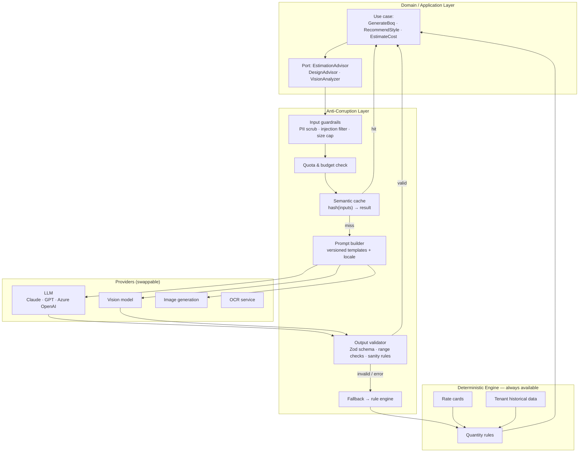

# 10 — AI Integration Architecture

---

## 1. Position

AI is a **bounded context with an anti-corruption layer**, not a feature sprinkled through the
codebase. Three rules govern every AI capability in this platform:

> **1. Deterministic first, AI at the edges.** Quantities come from a rule engine. AI adjusts
> factors, fills gaps, and explains — it does not invent numbers a client will be billed for.
>
> **2. AI never writes to the domain.** It produces a *suggestion*. A human accepts it, and the
> acceptance goes through the same validated domain command as manual entry.
>
> **3. AI failure degrades, never blocks.** Provider down, quota exhausted, malformed response —
> every core workflow continues on the deterministic path.

The reason is commercial, not philosophical. A contractor who is billed for 480 m² of tiles will
ask *why*. "The AI said so" ends the relationship. `floorArea(437.2) × (1 + waste 0.10) = 480.92`
does not.

---

## 2. Architecture



The domain depends only on `EstimationAdvisor`. Swapping providers, or turning AI off entirely,
changes one DI registration and nothing else.

---

## 3. Capability catalogue

| # | Capability | Approach | Determinism | Phase |
|---|---|---|---|---|
| A1 | Design-style recommendation | LLM + structured input | Advisory | 5 |
| A2 | Design brief parsing (free text → structured) | LLM with a strict output schema | Advisory | 5 |
| A3 | Material quantity estimation | **Rules** + LLM only for unmapped items | Deterministic core | 4 |
| A4 | Cost estimation (P10/P50/P90) | Rate cards + tenant history + LLM adjustment | Deterministic core | 4 |
| A5 | Duration & schedule prediction | Historical regression + LLM narrative | Deterministic core | 6 |
| A6 | Resource/crew estimation | Productivity rates + LLM adjustment | Deterministic core | 6 |
| A7 | Layout & finish suggestions | LLM mapped onto the catalogue | Advisory | 5 |
| A8 | Colour palette & lighting concept | LLM + curated palette library | Advisory | 5 |
| A9 | Mood-board imagery | Image generation | Advisory, watermarked | 7 |
| A10 | Invoice OCR | OCR service + LLM field extraction | Suggestion, human-confirmed | 6 |
| A11 | Photo progress analysis | Vision model | Advisory | 7 |
| A12 | Quality/defect detection from photos | Vision model | Advisory | 8 |
| A13 | Anomaly detection (cost/consumption) | Statistical, no LLM | Deterministic | 6 |
| A14 | Natural-language search & assistant | LLM + RAG over tenant data | Advisory | 8 |

Note how the modules the user asked for as "AI" (12, 13, 14) decompose: **BOQ generation is
mostly deterministic**, and that is a feature. The AI adds judgement where rules cannot reach —
style, brief interpretation, unusual items, narrative explanation.

---

## 4. Worked example — cost estimation

The pipeline that produces a defensible number:

```mermaid
flowchart LR
    IN["Unit: 180 m², 3 bed,<br/>premium, Riyadh"] --> RULES
    RULES["1. Quantity rules<br/>per room × per element"] --> BASE["Base quantities<br/>(fully explainable)"]
    BASE --> RATE["2. Rate card lookup<br/>region + pricing date"]
    RATE --> DET["Deterministic P50"]
    DET --> HIST["3. Tenant history<br/>same package, similar area,<br/>last 24 months"]
    HIST --> ADJ["4. LLM adjustment<br/>context: market, complexity,<br/>site condition, season"]
    ADJ --> BAND["5. P10 / P50 / P90 band"]
    BAND --> CONF["6. Confidence score<br/>from sample size + variance"]
    CONF --> OUT["Estimate + basis + rationale"]
```



**Confidence is computed, not claimed:**

| Basis available | Confidence | Presented as |
|---|---|---|
| ≥ 20 comparable tenant units | High (85–95 %) | "Based on your last 23 similar units" |
| 5–19 comparable units | Medium (65–85 %) | "Based on your last 8 similar units" |
| < 5 units, regional rate card | Low (45–65 %) | "Based on Riyadh regional rates — limited history" |
| No rate card for the region | Very low (< 45 %) | "Rough guide only — please set up a rate card" |

The UI never shows a bare number. It shows the range, the basis, the sample size, and a link to
the comparable units the estimate was drawn from.

---

## 5. Prompt management

Prompts are **versioned assets**, stored in `ai_prompt_templates`, reviewed like code:

```yaml
id: style_recommendation
version: 3
model: claude-opus-5
temperature: 0.4
locale: [en, ar]
system: |
  You are a senior interior designer working in the GCC market (Saudi Arabia, UAE, Egypt).
  You understand local preferences: majlis and guest-reception separation, gender-separated
  entertaining spaces where relevant, high ceilings, strong natural light, and a preference for
  durable, heat-tolerant finishes.
  Recommend ONLY from the allowed style enum. Respond ONLY with JSON matching the schema.
  If the input is insufficient, return {"insufficientInput": true, "missing": [...]}.
  Never invent material names that are not in the supplied catalogue subset.
user_template: |
  Unit type: {{unitType}}
  Total area: {{area}} m²
  Rooms: {{roomsSummary}}
  Ceiling height: {{ceilingHeight}} m
  Budget band: {{finishingLevel}}
  Region: {{city}}, {{country}}
  Client notes: {{clientNotes}}
  Available catalogue categories: {{catalogueCategories}}
output_schema:
  type: object
  required: [style, rationale, palette, lighting, furnitureDirection, confidence]
  properties:
    style: { enum: [modern, contemporary, minimal, classic, neo_classic, luxury, industrial, scandinavian] }
    rationale: { type: string, maxLength: 600 }
    palette:
      type: array
      minItems: 3
      maxItems: 6
      items: { type: object, required: [name, hex, usage] }
    confidence: { type: number, minimum: 0, maximum: 100 }
```

**Why versioning matters:** when estimates start looking wrong, the first question is "what
changed?" Every `ai_request` records `prompt_version` and `model_id`, so a behavioural shift is
attributable to a specific prompt edit or model upgrade rather than being a mystery.

A/B evaluation runs new prompt versions against a golden set of ~200 historical cases with known
outcomes, comparing accuracy and acceptance rate before promotion.

---

## 6. Guardrails

### 6.1 Input

| Guard | Purpose |
|---|---|
| PII scrubbing | Client names, national IDs, phone numbers, and addresses are replaced with placeholders before leaving the platform |
| Injection filtering | User free text (design briefs, notes) is delimited and explicitly marked as untrusted data in the prompt; instruction-shaped content is neutralised |
| Size caps | Max 8 K input tokens per request; oversized inputs are summarised deterministically first |
| Tenant data isolation | A prompt may contain only the requesting tenant's data. Cross-tenant context is structurally impossible — the retrieval layer is tenant-scoped |
| Cost pre-check | Estimated token cost is checked against the remaining quota **before** dispatch |

> **On prompt injection:** a client's design brief is user-supplied text that ends up in a
> prompt. It is wrapped in explicit delimiters and preceded by an instruction that content inside
> is data to be interpreted, never instructions to be followed. Output is schema-validated
> regardless, so a successful injection still cannot produce a value the domain will accept.

### 6.2 Output

| Guard | Purpose |
|---|---|
| Schema validation | Zod parse against the declared output schema; one retry with a repair prompt, then fallback |
| Range sanity | Cost within 0.3×–3× the deterministic estimate, quantities within 0.5×–2× the rule result — outside that band the AI value is discarded and logged for review |
| Catalogue grounding | Any suggested material must resolve to a real catalogue ID; hallucinated products are dropped |
| Content safety | Provider safety filters plus a local check on user-visible text |
| No silent writes | Output lands in `ai_suggestions` with `status = pending`. Nothing enters a domain aggregate without an explicit human `apply` |

---

## 7. Cost control

AI cost is the one operating expense that scales with usage but not automatically with revenue.
It is engineered, not monitored after the fact.

| Control | Detail |
|---|---|
| **Per-tenant quotas** | Tokens/day, requests/day, USD/month by plan. Enforced pre-dispatch |
| **Semantic caching** | `hash(normalised inputs + prompt version + model)` → result, 30-day TTL. Twelve identical apartments in one tower generate **one** AI call, not twelve |
| **Tiered models** | Cheap/fast model for classification and parsing; the frontier model only for genuine reasoning (style, estimation narrative) |
| **Deterministic-first routing** | If the rule engine fully covers a request, no AI call is made at all |
| **Batching** | Per-room suggestions for one unit go in a single request, not one per room |
| **Streaming for perceived latency** | Long narratives stream to the UI |
| **Circuit breaker** | 5 failures in 60 s opens the breaker for 5 minutes; the deterministic path serves everything meanwhile |
| **Hard monthly ceiling** | Platform-wide cap; on breach, AI disables itself and alerts operations rather than generating an unbounded bill |

**Unit economics target:** ≤ $0.40 of AI cost per unit over its entire lifecycle, against a
subscription contribution far exceeding it. Every AI call records `cost_usd`, so per-tenant and
per-unit margin is a query, not a guess.

---

## 8. Feedback loop

Every suggestion records what the human did with it:

```
suggestion → accepted as-is        → strong positive signal
           → accepted with edits   → the edit itself is the label (most valuable signal)
           → rejected              → negative signal + optional reason
```

Stored in `ai_feedback` with the user's final values. This corpus drives:

1. **Prompt refinement** — recurring edits reveal a systematic prompt flaw.
2. **Rule-engine improvement** — if users consistently adjust the tile waste factor from 10 % to
   13 % in Jeddah, that belongs in the *rule table*, not the model. The AI's most valuable
   output is often a better deterministic default.
3. **Tenant-specific calibration** — per-tenant adjustment factors learned from their own
   acceptance history, applied deterministically.
4. **Model evaluation** — acceptance rate is the headline metric per prompt version.

**Fine-tuning is deliberately deferred.** With a strong rule engine and per-tenant calibration
factors, fine-tuning is an expensive answer to a problem that better data structures solve more
cheaply and more explainably.

---

## 9. RAG for the assistant (Phase 8)

The natural-language assistant ("how much did we spend on flooring in Al Nakheel Tower?") uses
retrieval over tenant data with a hard isolation boundary:

```
Question → intent classification (cheap model)
  ├── structured query intent → generate a PARAMETERISED query against a whitelisted view set
  │                             → execute with the requester's own permissions
  │                             → LLM narrates the result set
  └── document intent        → vector search over the tenant's OWN documents only
                              → cite sources → LLM answers with citations
```

**Non-negotiable constraints:**
- Vector index is partitioned per tenant; a query cannot address another partition.
- Generated SQL is never executed directly. The model selects from a whitelist of parameterised
  query templates and supplies bound parameters.
- Retrieval runs under the *requesting user's* permissions — a site engineer cannot reach cost
  data through the assistant that the UI hides from them.
- Every answer cites its sources so the user can verify.

---

## 10. Vision capabilities

| Capability | Input | Output | Reality check |
|---|---|---|---|
| Progress estimation | Stage photos + stage type | Estimated % + rationale | Advisory only; the engineer's number always wins |
| Quality check | "After" photos + checklist | Flagged concerns (uneven tiles, visible gaps, missing sealant) | A prompt to inspect, never a rejection |
| Safety observation | Site photos | PPE and hazard observations | Advisory |
| Material identification | Photo of a delivery | Suggested catalogue match | Confirmed by the user |
| Invoice OCR | Invoice photo/PDF | Supplier, date, total, VAT, line items | **Always confirmed by a human before commit** |

**Vision output is never authoritative.** A model that flags a perfectly good tile job as
defective, and blocks a stage as a result, destroys trust in the entire product. It surfaces a
concern; a person decides.

---

## 11. Data privacy

| Concern | Policy |
|---|---|
| Provider data retention | Zero-retention API tiers only; contractually no training on customer data |
| PII | Scrubbed before dispatch; the platform holds the mapping, the provider never sees the identity |
| Photos | Only sent when the tenant explicitly enables vision features; opt-in, per tenant, per capability |
| Regional constraints | Tenants under strict residency can disable AI entirely, or be routed to an in-region provider endpoint |
| Transparency | Every AI-generated value is visibly labelled in the UI and in exported documents |
| Audit | Full request/response logged for 12 months; the tenant can export their own AI history |
| Right to delete | AI request history is included in tenant data deletion |

Every AI-derived figure carries a badge in the UI and a footnote in generated PDFs: *"This
estimate was produced with AI assistance and is indicative, not contractual."* That line is a
legal requirement as much as a UX one.

---

## 12. Provider abstraction

```ts
interface LlmProvider {
  complete(req: LlmRequest): Promise<LlmResponse>
  stream(req: LlmRequest): AsyncIterable<LlmChunk>
  countTokens(text: string): number
  readonly capabilities: { vision: boolean; json: boolean; maxTokens: number }
}
```

Implementations: `AnthropicProvider`, `OpenAiProvider`, `AzureOpenAiProvider`, plus
`MockProvider` for tests and `NullProvider` for AI-disabled tenants.

**Routing policy** — declared as configuration, not hard-coded:

| Task | Primary | Fallback |
|---|---|---|
| Classification / parsing | Small fast model | Rule-based parser |
| Estimation reasoning | Frontier model | Deterministic engine |
| Vision | Vision-capable model | Feature disabled with a clear message |
| Image generation | Image model | Curated stock mood-boards |

A provider outage triggers the fallback automatically. The user sees "AI suggestions
unavailable — showing rule-based estimate", which is honest, actionable, and does not stop them
working.

---

## 13. Observability

| Metric | Alert |
|---|---|
| Requests / tokens / cost per tenant per day | > 120 % of budget |
| Acceptance rate per suggestion type | < 40 % — the feature is not earning its cost |
| Schema-validation failure rate | > 5 % — the prompt or model has drifted |
| Fallback rate | > 10 % — provider instability |
| p95 latency per task type | > 20 s |
| Cache hit rate | < 30 % — cache keys are too specific |
| Guardrail rejections | Any spike — possible injection attempt |

**Acceptance rate is the product metric.** A capability that users reject 70 % of the time is
costing money and eroding trust, and should be improved or removed — not left running because it
demos well.
