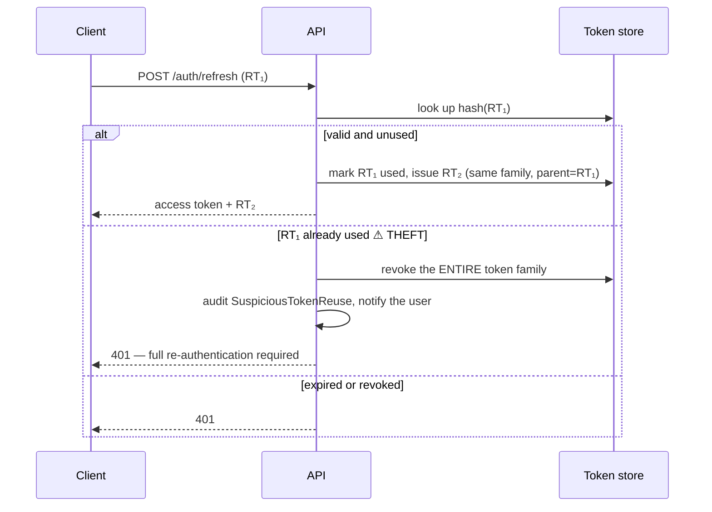

# 11 — Security Architecture

Target: **OWASP ASVS Level 2**, with Level 3 controls on authentication and financial data paths.
Security is designed at the start because retrofitting tenant isolation, audit trails, and token
rotation into a live multi-tenant system is not a refactor — it is a rewrite.

---

## 1. Threat model

| # | Threat | Impact | Primary control |
|---|---|---|---|
| T1 | **Cross-tenant data access** | Company-ending | Three-layer tenant enforcement (§3) |
| T2 | Credential stuffing / brute force | Account takeover | Rate limiting, lockout, MFA, breach-password check |
| T3 | Token theft / replay | Session hijack | Short access tokens, rotating refresh with reuse detection, device binding |
| T4 | Privilege escalation | Unauthorised financial access | Server-side RBAC + ABAC on every request, no client trust |
| T5 | SQL injection | Data breach | Parameterised queries only; raw SQL banned by lint |
| T6 | Stored XSS via notes/comments | Session theft | Output encoding, sanitisation on rich text, strict CSP |
| T7 | Malicious file upload | RCE / malware distribution | Type + magic-byte validation, AV scan, isolated storage, no execution |
| T8 | IDOR on documents/photos | Data leak | Ownership check on every access; signed, expiring URLs |
| T9 | Insider misuse | Data theft, fraud | Immutable audit log, least privilege, download logging |
| T10 | Supply-chain compromise | Full compromise | Lockfiles, SCA scanning, pinned base images, SBOM |
| T11 | Prompt injection via user text | Data exfiltration through AI | Delimited untrusted input, output schema validation, tenant-scoped retrieval |
| T12 | Mobile device loss | Local data exposure | SQLCipher, secure keystore, biometric gate, remote revocation |
| T13 | DoS / resource exhaustion | Availability | Per-tenant rate limits, query timeouts, upload caps, queue fairness |
| T14 | Ransomware on backups | Unrecoverable loss | Immutable, versioned, off-site backups; quarterly restore drills |

---

## 2. Authentication

### 2.1 Passwords

| Control | Value |
|---|---|
| Hashing | **argon2id**, m=64 MiB, t=3, p=4 (tuned to ~250 ms on production hardware) |
| Minimum length | 12 characters; no composition rules — length beats complexity theatre |
| Breach check | k-anonymity range query against a compromised-password corpus at set/change time |
| Rehash on login | Automatic when parameters are upgraded |
| History | Last 5 hashes retained to prevent immediate reuse |
| Reset tokens | 32-byte random, SHA-256 hashed at rest, 30-minute expiry, single use, invalidates all sessions |
| Timing | Constant-time comparison; identical response time and message for unknown vs. wrong password |

### 2.2 Token strategy

| Token | TTL | Storage (web) | Storage (mobile) | Contents |
|---|---|---|---|---|
| Access (JWT) | **15 min** | Memory only | Secure keystore | `sub`, `companyId`, `roles`, `permHash`, `sessionId`, `aud`, `jti` |
| Refresh (opaque) | **30 days** | `httpOnly` `Secure` `SameSite=Strict` cookie | Secure keystore | Random 32 bytes; SHA-256 stored server-side |
| Portal | 60 min | `httpOnly` cookie | — | `aud: portal` — structurally cannot call internal APIs |
| API key | Configurable | — | — | Prefix + hash, scoped, per-tenant |

**Access tokens are never in `localStorage`.** An XSS that can read `localStorage` gets a
long-lived credential; one that can only make requests is bounded by the session.

The JWT carries a `permHash`, not the full permission list. Permissions are resolved server-side
from cache — so a permission revocation takes effect within 60 seconds without waiting for a
15-minute token to expire, and the token stays small.

### 2.3 Refresh rotation with reuse detection



A stolen refresh token is usable at most once. The moment either the attacker or the legitimate
user presents the consumed token, the whole family dies and the user is told. This is the single
highest-value authentication control in the design.

### 2.4 MFA and sessions

- TOTP (RFC 6238) with 10 single-use recovery codes, argon2-hashed.
- Optional per user; **enforceable per company policy**; mandatory for Company Owner and any
  role holding `cost.*` or `user.manage` permissions.
- SMS OTP available where TOTP adoption is unrealistic, with its weaker security documented.
- Sessions are listable and individually revocable by the user; "log out everywhere" is one
  action.
- Anomaly signals (new country, new device, impossible travel) trigger an email/push alert and
  optionally a step-up challenge.
- SSO (SAML 2.0 / OIDC) with SCIM provisioning arrives in Phase 6 for Enterprise.

---

## 3. Authorization

### 3.1 Three-layer model

```
1. RBAC   — does this role hold this permission?          route-level, coarse
2. ABAC   — is this user assigned to THIS project/unit?   handler-level, contextual
3. Field  — may this user see THIS column?                presenter-level, e.g. cost
```

All three run server-side on every request. The client's copy is a UX convenience with no
security value.

### 3.2 Permission catalogue (excerpt)

| Resource | Actions |
|---|---|
| `client` | view, create, update, delete, export |
| `project` | view, view_all, create, update, delete, change_status, manage_team |
| `unit` | view, view_all, create, update, delete, clone, deliver |
| `stage` | view, update_progress, complete, approve, reject, assign |
| `boq` | view, generate, update, override_line, approve, export |
| `material` | view, create, update, record_consumption, adjust_stock |
| `purchase` | view, create, approve, receive |
| `invoice` | view, create, update, allocate, record_payment, void |
| `cost` | **view**, view_margin, update_budget |
| `document` | view, upload, download, delete, share_external |
| `report` | view, run, export, schedule |
| `user` | view, invite, update, deactivate, manage_roles |
| `company` | view_settings, update_settings, manage_billing, manage_integrations |
| `ai` | use, view_usage |

`view` vs. `view_all` is the ABAC hinge: `view` means "records I am assigned to";
`view_all` means "every record in the company".

### 3.3 Default role matrix

| Permission group | Super Admin | Owner | PM | Site Eng | Designer | Procurement | Accountant | Client |
|---|:--:|:--:|:--:|:--:|:--:|:--:|:--:|:--:|
| Clients | ● | ● | ◐ | — | ◐ | — | ◐ | — |
| Projects | ● | ● | ◐ assigned | ◐ view | ◐ view | ◐ view | ◐ view | ◐ own |
| Units | ● | ● | ◐ assigned | ◐ assigned | ◐ assigned | ◐ view | ◐ view | ◐ own |
| Stage progress | ● | ● | ● | ● update | — | — | — | ◐ view |
| Stage approval | ● | ● | ● | — | — | — | — | ◐ if enabled |
| Floor plans / 3D | ● | ● | ◐ view | ◐ view | ● | — | — | ◐ view |
| BOQ | ● | ● | ● | ◐ qty only | ◐ view | ◐ view | ◐ view | ◐ own quote |
| Materials | ● | ● | ● | ◐ consume | — | ● | ◐ view | — |
| Purchases / invoices | ● | ● | ◐ view | ◐ upload | — | ● | ● | — |
| **Cost & prices** | ● | ● | ● | **—** | ◐ view | ● | ● | ◐ own only |
| Profitability | ● | ● | ◐ | — | — | — | ● | — |
| Users & roles | ● | ● | — | — | — | — | — | — |
| Billing | ● | ● | — | — | — | — | — | — |

● full · ◐ partial/scoped · — none

**The site engineer sees quantities but not prices.** This is field-level authorization applied
at the presenter, and it is one of the most frequently requested controls in this industry —
crews should not learn the company's margin from a phone screen.

### 3.4 Implementation

```ts
// route level — coarse
{ preHandler: [requirePermission('stage.approve')] }

// handler level — contextual
if (!ctx.canInScope('stage.approve', { projectId: wf.projectId }))
  return err(Forbidden())

// presenter level — field
return present(unit, { includeCost: ctx.can('cost.view') })
```

Every denial writes an audit record with subject, resource, and reason. A spike in denials is a
security signal, and is alerted on.

---

## 4. Tenant isolation

The T1 control set, restated because it is the most important thing in this document:

| Layer | Mechanism | Failure mode |
|---|---|---|
| 1. Context | `AsyncLocalStorage` from a verified JWT claim | Absent context → **throw**, never proceed |
| 2. Data access | Prisma client extension injects `companyId` into every operation | Cannot be bypassed; raw SQL banned by lint |
| 3. Verification | Mandatory per-repository cross-tenant test suite | New repository without the test → CI fails |

Plus:
- Every tenant-scoped index is `company_id`-prefixed, so a missing predicate is a visible
  performance cliff as well as a correctness bug.
- Every cache key is tenant-prefixed; the key builder has no overload without `companyId`.
- Object storage keys are `{companyId}/{entityType}/{entityId}/{objectId}`, and signed URLs are
  issued only after an ownership check.
- Queue jobs carry `companyId` and establish context before touching data.
- Cross-tenant identifiers return **404, not 403**.
- Enterprise tenants can be moved to a dedicated database with no application change.

---

## 5. Application security controls

### 5.1 Input handling

| Control | Implementation |
|---|---|
| Validation | Zod at every boundary — body, query, params, headers. Unknown keys rejected |
| Type coercion | Explicit; no implicit `any` |
| Size limits | 1 MB JSON body, 100 MB per file, 20 files per request |
| SQL injection | Prisma parameterisation; `$queryRaw` restricted to one audited directory, always with bound parameters |
| NoSQL/command injection | No shell execution with user input, anywhere |
| Path traversal | Object keys are generated server-side; user-supplied filenames are stored as metadata only and never used as a path |
| SSRF | Webhook and integration URLs validated against an allow-list; private IP ranges and link-local addresses blocked; redirects not followed |
| Mass assignment | DTOs are explicit allow-lists; entities are never constructed from a raw request body |

### 5.2 Output handling

| Control | Implementation |
|---|---|
| XSS | Vue escapes by default; `v-html` is banned by lint except for HTMLPurifier-sanitised rich text |
| Rich text | DOMPurify client-side **and** sanitise-html server-side — never client-only |
| CSP | `default-src 'self'; script-src 'self'; object-src 'none'; frame-ancestors 'none'; base-uri 'self'` — no `unsafe-inline`, nonces for the few required inline blocks |
| CSRF | `SameSite=Strict` cookies + double-submit token on cookie-authenticated routes; Bearer-token routes are not cookie-authenticated and therefore not CSRF-exposed |
| Clickjacking | `X-Frame-Options: DENY` + `frame-ancestors 'none'` |
| MIME sniffing | `X-Content-Type-Options: nosniff` |
| HSTS | `max-age=31536000; includeSubDomains; preload` |
| Referrer | `strict-origin-when-cross-origin` |
| Permissions-Policy | Camera/microphone/geolocation denied except on the routes that need them |
| Error detail | Stack traces never returned to clients; a correlation ID is returned instead |

### 5.3 File upload

```
1. Client requests a presigned URL — server validates declared type and size against policy
2. Extension allow-list        jpg jpeg png heic webp pdf dwg dxf xlsx docx mp4
3. Magic-byte verification     server-side after upload; the declared MIME is not trusted
4. Malware scan                ClamAV in the media worker; status starts `pending`
5. Image re-encode             strips embedded payloads and normalises EXIF
6. Storage                     private bucket, no public ACL, no execute permission, tenant-prefixed key
7. Access                      signed URL, 15-minute expiry, issued only after an ownership check
8. Download logging            who downloaded which version, when, from where
```

**Nothing is downloadable while `scan_status ∈ {pending, infected}`.** A quarantined file is
visible in the UI as blocked, with the reason — silence would look like a bug and generate a
support ticket.

---

## 6. Infrastructure security

| Layer | Controls |
|---|---|
| Network | Private subnets for DB/Redis; no public database endpoint; security groups default-deny |
| TLS | 1.2 minimum (1.3 preferred), modern ciphers, HSTS preload, automated certificate rotation |
| WAF | OWASP core rule set, rate limiting, geo-rules, bot mitigation |
| Secrets | Platform secret manager, rotated quarterly; **no secrets in code, environment files, or logs** |
| Encryption at rest | Database, object storage, and backups encrypted with managed keys |
| Container | Non-root user, read-only root filesystem, minimal distroless base, pinned digests |
| Dependencies | Lockfiles committed, Dependabot/Renovate, `npm audit` + Snyk in CI, SBOM per release |
| Access | SSO + MFA for all engineer access; just-in-time production access with approval and session recording |
| Backups | Encrypted, versioned, immutable (object-lock), cross-region, quarterly restore drills |

---

## 7. Audit logging

### 7.1 What is always audited

| Category | Events |
|---|---|
| Authentication | Login success/failure, logout, token refresh, **token reuse detection**, password change, MFA enable/disable, session revocation |
| Authorization | Permission grant/revoke, role change, **every denial** |
| Data — create | Every business entity |
| Data — update | Every business entity, with a field-level before/after diff |
| Data — delete | Soft and hard, reason mandatory |
| **Financial** | Cost change, budget change, BOQ line override, price change, allocation, payment, invoice void |
| **Workflow** | Every stage transition, approval, rejection with reason |
| **Material** | Every stock movement, adjustment, reversal |
| Documents | Upload, download, share, permission change, delete |
| Admin | Company settings, subscription, integrations, API keys, webhooks |
| AI | Every request, suggestion, and accept/reject decision |

### 7.2 Record shape

```json
{
  "id": "018f2a…",
  "companyId": "018f1b…",
  "actorUserId": "018f3c…",
  "actorType": "user",
  "action": "boq.line.overridden",
  "entityType": "boq_line",
  "entityId": "018f4d…",
  "entityLabel": "Porcelain tiles 60×60 — Master Bedroom",
  "before": { "quantity": "48.5000", "materialRate": "85.0000" },
  "after":  { "quantity": "52.0000", "materialRate": "85.0000" },
  "changedFields": ["quantity"],
  "reason": "Site measurement corrected after demolition",
  "ipAddress": "31.***.***.42",
  "userAgent": "BuildFlow-iOS/1.8.0",
  "requestId": "01J8X…",
  "source": "mobile",
  "occurredAt": "2026-08-15T09:31:22.481Z"
}
```

### 7.3 Guarantees

- Written **inside the same transaction** as the change — an audit write that fails rolls back
  the change, because a change with no record is worse than no change.
- Append-only: no application code path can update or delete an audit row; the application
  database user holds no `UPDATE`/`DELETE` grant on the table.
- Retained 7 years (financial regulation), partitioned monthly, archived to cold storage after 1
  year.
- Tenant-visible: customers can search and export their own audit trail — an enterprise
  procurement requirement, not a nice-to-have.
- Reason is **mandatory** for: hard delete, cost override, quantity adjustment, stage rejection,
  permission change, and project hold.

---

## 8. Privacy & compliance

| Requirement | Implementation |
|---|---|
| **Data minimisation** | National ID collected only where legally required, encrypted at rest, masked in the UI except to authorised roles |
| **Purpose limitation** | Client contact data is never used for cross-tenant marketing; contractually and technically separated |
| **Residency (KSA PDPL)** | Region-pinned deployment; `data_region` on the company record; cross-region movement blocked by policy and configuration |
| **Right of access** | Self-service data export per tenant, generated by a worker |
| **Right to erasure** | Soft-suspend 30 days → anonymise → purge; the audit trail retains the *fact* of the record with identifiers removed |
| **Breach notification** | Documented 72-hour process with a named owner, a communication template, and a rehearsed runbook |
| **Sub-processors** | Published list (cloud, email, SMS, AI provider) with DPAs; tenants notified before changes |
| **Retention** | Per-category policy, automatically enforced by the retention job |

---

## 9. Secure development lifecycle

| Stage | Control |
|---|---|
| Design | Threat model per new module; security review required for anything touching auth, tenancy, or money |
| Code | Mandatory review; security-sensitive paths need a second reviewer |
| CI | SAST (Semgrep), SCA (Snyk), secret scanning (gitleaks), licence checks, dependency-cruiser |
| Test | Tenant-isolation suite (gated), authorization tests per endpoint, negative-path tests |
| Pre-release | DAST (OWASP ZAP) against staging |
| Release | Signed images, SBOM, immutable tags, documented rollback |
| Runtime | Sentry, anomaly alerting, weekly dependency review |
| Annual | Third-party penetration test; findings tracked to closure with SLAs by severity |

**Merge blockers:** any high/critical SAST or SCA finding, any leaked secret, any failing
tenant-isolation test, any endpoint added without an authorization test.

---

## 10. Incident response

| Phase | Actions |
|---|---|
| **Detect** | Alerting on 5xx spikes, auth anomalies, permission-denial spikes, token-reuse events, storage anomalies |
| **Triage** | Severity 1–4; Sev-1 (confirmed cross-tenant exposure or data breach) pages immediately, 24×7 |
| **Contain** | Revoke tokens/sessions, disable the affected tenant or feature flag, block the source, rotate secrets |
| **Eradicate** | Patch, verify with a targeted test, deploy |
| **Recover** | Restore from a verified backup if needed; confirm integrity before reopening access |
| **Notify** | Affected tenants and regulators within statutory windows; the template is pre-written, not drafted under pressure |
| **Learn** | Blameless post-mortem within 5 working days; every action item gets an owner and a date |

**Sev-1 definition includes any confirmed cross-tenant data exposure, however small.** One row is
a Sev-1. That framing is deliberate: the moment "small" leaks become acceptable, the isolation
guarantee stops being a guarantee.
