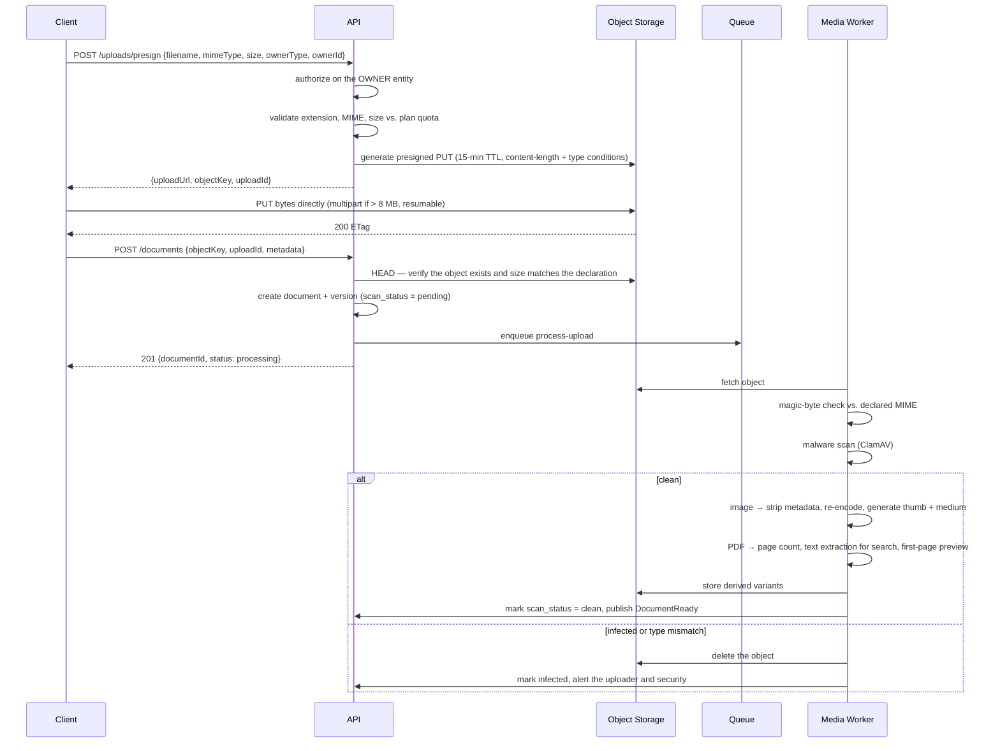

# 13 — Document & Media Management Architecture

The platform will hold site photos, invoice scans, drawings, contracts, BOQ exports, and PDFs.
At scale this is the largest data volume in the system by two orders of magnitude — roughly
90 million photo objects at 500 tenants — and it is also the most permission-sensitive.

---

## 1. Design principles

1. **Binary content never lives in the database.** Metadata in MySQL, bytes in object storage.
2. **Bytes never stream through the API tier.** Presigned upload, presigned download. The
   application server issues permission decisions, not megabytes.
3. **Every object is private by default.** No public buckets, no guessable URLs, no exceptions.
4. **Versions are immutable.** A "new version" is a new object; the old one is never overwritten.
5. **A logical document is separate from its stored objects**, so versioning, renaming, and
   re-categorisation never touch storage.
6. **Nothing is served before it is scanned.**

---

## 2. Storage abstraction

```ts
interface FileStorage {
  presignUpload(key: string, opts: PresignOptions): Promise<PresignedUpload>
  presignDownload(key: string, ttlSeconds: number, filename?: string): Promise<string>
  head(key: string): Promise<ObjectMetadata>
  copy(from: string, to: string): Promise<void>
  delete(key: string): Promise<void>
  createMultipart(key: string, parts: number): Promise<MultipartSession>
}
```

Implementations: `S3Storage` (production) · `MinioStorage` (self-hosted / on-prem tenants) ·
`LocalStorage` (development) · `InMemoryStorage` (tests). Because everything goes through this
port, moving a tenant from MinIO to S3 — or to an in-Kingdom provider for residency — is a
configuration change.

### 2.1 Key structure

```
{companyId}/{ownerType}/{ownerId}/{documentId}/v{version}/{objectId}.{ext}

018f1b…/unit_stage/018f4d…/018f7a…/v1/018f7b….jpg
018f1b…/unit_stage/018f4d…/018f7a…/v1/018f7b….thumb.webp
018f1b…/unit_stage/018f4d…/018f7a…/v1/018f7b….med.webp
```

Tenant-first prefixing gives per-tenant lifecycle rules, per-tenant usage metering by prefix
listing, straightforward per-tenant export, and clean bulk deletion on offboarding. Object names
are server-generated UUIDs — a user-supplied filename is stored as metadata and used only in the
`Content-Disposition` header on download, so it can never influence a storage path.

### 2.2 Storage classes and lifecycle

| Age / state | Class | Rationale |
|---|---|---|
| 0–90 days | Standard | Active projects, frequently viewed |
| 90–365 days | Infrequent Access | Completed stages, occasionally revisited |
| > 365 days, unit delivered | Archive / Glacier | Legal retention, rarely read |
| Thumbnails and medium variants | Standard, always | Tiny, and needed for every gallery render |
| Soft-deleted | Standard 30 days → purge | Recovery window |

Thumbnails are deliberately never demoted: they are a few kilobytes each, and a gallery that
stalls waiting on archive retrieval is a broken gallery.

---

## 3. Upload flow



**Why the API verifies with `HEAD` rather than trusting the client's confirmation:** a client
could claim an upload completed without uploading anything, producing a document record pointing
at nothing. The `HEAD` check is cheap and closes that gap.

### 3.1 Validation rules

| Check | Rule |
|---|---|
| Extension allow-list | `jpg jpeg png webp heic pdf dwg dxf xlsx xls docx csv mp4 mov` |
| **Magic bytes** | Verified server-side after upload — the declared MIME type is never trusted |
| Size | 100 MB per file (500 MB for video), 20 files per request |
| Quota | Cumulative tenant storage checked before presigning |
| Dimensions | Images above 12,000 px on any edge are rejected (decompression-bomb defence) |
| PDF | Page count capped at 500; JavaScript and embedded-file objects stripped |
| Filename | Sanitised for display; never used as a path component |
| Re-encode | All images re-encoded, which strips embedded payloads and normalises EXIF |

---

## 4. Image pipeline

Every uploaded image produces a variant set:

| Variant | Size | Format | Use |
|---|---|---|---|
| `thumb` | 320 px | WebP q75 | Grids, list rows, mobile gallery |
| `medium` | 1024 px | WebP q80 | Detail view, lightbox on mobile |
| `large` | 1920 px | WebP q85 | Desktop lightbox, before/after slider |
| `original` | As uploaded | Original | Download, legal evidence, zoom |

Processing uses `sharp` in the media worker. HEIC (the iPhone default) is converted to WebP/JPEG
on ingest, because most browsers cannot display it. EXIF orientation is applied and then
stripped; capture time and GPS are extracted into the `photos` row first, so the information is
preserved as queryable data rather than as metadata riding along inside a file.

**Mobile clients compress before upload** (1920 px, q82) — see
[09 — Mobile](09-mobile-architecture.md#6-photo-capture-pipeline). The server pipeline still
runs, because a web upload of a 40 MP DSLR photo needs the same treatment.

### 4.1 Delivery

Images are served through the CDN with signed URLs. Gallery rendering uses responsive `srcset`
so a phone downloads the 320 px variant, not the 1920 px one — the difference across a
200-photo gallery is roughly 60 MB versus 3 MB of transfer.

---

## 5. Document versioning

```
Document (logical)
├── version 1  contract_draft.pdf     2026-03-01  Ahmed   "Initial draft"
├── version 2  contract_draft.pdf     2026-03-04  Sara    "Client comments incorporated"
└── version 3  contract_signed.pdf    2026-03-09  Ahmed   "Signed copy"   ← current
```

- A version is immutable once scanned clean.
- `documents.current_version_id` points at the active version.
- Any version remains downloadable if the user holds permission — required for disputes.
- Version history shows who, when, and the change note.
- Deleting a document soft-deletes the logical record; objects are purged after the retention
  window by the retention job.
- Restoring an old version creates a *new* version whose content is a copy — history is never
  rewritten.

**Versioning applies to documents, not photos.** A site photo is a point-in-time record; "version
2 of the before photo" is a meaningless concept. Photos are append-only; corrections are new
photos.

---

## 6. Categorisation

| Owner | Typical categories |
|---|---|
| Company | Licence, tax certificate, insurance, logo |
| Client | ID copy, contract, correspondence |
| Project | Contract, permits, approvals, drawings, schedule |
| Unit | Floor plan, BOQ, quotation, handover certificate, warranty |
| Unit stage | **Before / during / after photos**, inspection report, checklist evidence |
| Supplier | Trade licence, price list, agreement |
| Invoice | Invoice scan, delivery note, payment receipt |
| Snag | Defect photo, rectification photo |

Categories are tenant-extensible with an optional `retention_days` per category, so a tenant can
say "supplier quotations are purged after 3 years" and have it enforced automatically rather
than remembered manually.

---

## 7. Access control

Access requires **both** an entity permission and an ownership check:

```
canAccess(user, document) =
      user.hasPermission('document.view')
  AND user.canAccess(document.ownerType, document.ownerId)     // ABAC scope
  AND (document.visibility != 'internal' OR user.isInternal)
  AND (no explicit deny grant)
```

| Visibility | Who sees it |
|---|---|
| `internal` | Company staff with scope access only |
| `client_visible` | Also the client who owns the unit/project, via the portal |
| `public_link` | Anyone holding an unexpired signed link |

**Explicit grants** (`document_access_grants`) extend access to a specific user, role, or client
beyond the normal rules, with an optional expiry — the "send the contract to the client's lawyer
for two weeks" case.

**Public links** carry a hashed token, an expiry, an optional password, an optional download cap,
and a view counter, and are individually revocable. Every access is logged.

### 7.1 Download logging

Every download writes `download_logs` (document version, user, IP, timestamp). This is an
enterprise procurement requirement — a customer must be able to prove who accessed a contract —
and it is also the primary detection mechanism for insider data exfiltration. An alert fires on
anomalous volume (e.g. one user downloading 200 documents in an hour).

---

## 8. Search

| Content | Method |
|---|---|
| Filename, title, description, tags | MySQL FULLTEXT (ngram parser for Arabic) |
| PDF text | Extracted on ingest into a `document_text` table, indexed FULLTEXT |
| Photo metadata | Structured filters: stage, category, room, date range, uploader |
| Photo content | Vision-model tagging (Phase 7) — "show me all electrical conduit photos" |

Search moves to OpenSearch at Stage 3 when the corpus and query complexity outgrow MySQL
FULLTEXT. The abstraction (`DocumentSearchPort`) exists from day one so that migration is an
adapter swap.

---

## 9. Storage economics

A realistic per-unit media footprint:

| Item | Count | Avg size | Total |
|---|---|---|---|
| Stage photos (14 stages × ~25) | 350 | 350 KB | 122 MB |
| Variants (thumb + medium + large) | 1,050 | 90 KB avg | 95 MB |
| Invoice scans | 40 | 500 KB | 20 MB |
| Drawings / plan exports | 15 | 2 MB | 30 MB |
| Documents (contracts, BOQ, reports) | 25 | 400 KB | 10 MB |
| **Per unit** | | | **≈ 280 MB** |

| Scale | Units | Raw storage |
|---|---|---|
| 500 tenants × 100 units | 50,000 | ≈ 14 TB |
| With lifecycle tiering | | ≈ 3 TB standard + 11 TB archive |

Cost controls: aggressive client-side compression, WebP variants, lifecycle tiering, per-plan
quotas with paid overage, deduplication by SHA-256 checksum (the same drawing attached to twelve
units stores once), and CDN caching to keep egress down. Storage is metered per tenant daily and
shown in-product, so overage is a conversation the customer sees coming.

---

## 10. Retention & deletion

| Trigger | Behaviour |
|---|---|
| User deletes a document | Soft delete; recoverable for 30 days; objects retained |
| Retention period elapses | Retention job purges objects and marks the row purged |
| Unit delivered + 7 years | Financial documents archived, then purged per policy |
| Tenant cancels | 90-day grace (read-only export available) → anonymise → purge |
| Legal hold | Blocks every purge path for the flagged entity until released |
| GDPR/PDPL erasure request | Targeted purge; the audit trail retains the *fact* with identifiers removed |

Deletion is always a **job**, never a synchronous API action. Deleting a project with 8,000
photos must not block an HTTP request, and it must be resumable if it fails halfway.

---

## 11. Offline & mobile considerations

| Concern | Approach |
|---|---|
| Upload queue | Local file + outbox entry; survives app kill and restart |
| Resumable | Multipart upload with per-part retry; never restarts from zero |
| Wi-Fi preference | Default Wi-Fi-only, user-overridable |
| Local retention | Full-size original kept until server confirmation, then deleted; thumbnail retained |
| Eviction | LRU on *synced* files only — an unsynced original is never evicted |
| Offline viewing | Plans and recent stage photos cached as thumbnails/tiles |
| Storage pressure | Warn at 80 % of the app's budget; suggest sync, never silently delete |

---

## 12. Disaster recovery

| Control | Detail |
|---|---|
| Object versioning | Enabled — an accidental overwrite is recoverable |
| Cross-region replication | Async, subject to residency constraints (a KSA-pinned tenant replicates within region) |
| Object lock | Compliance mode on backups — ransomware cannot delete them |
| Checksums | SHA-256 stored per version and verified on a rolling monthly integrity sweep |
| Orphan detection | Weekly reconciliation of storage objects against database rows, in both directions — orphaned objects are reported, and a database row pointing at a missing object raises an alert |
| Restore drill | Quarterly, including media, with the result recorded |
