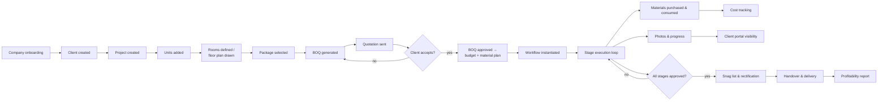
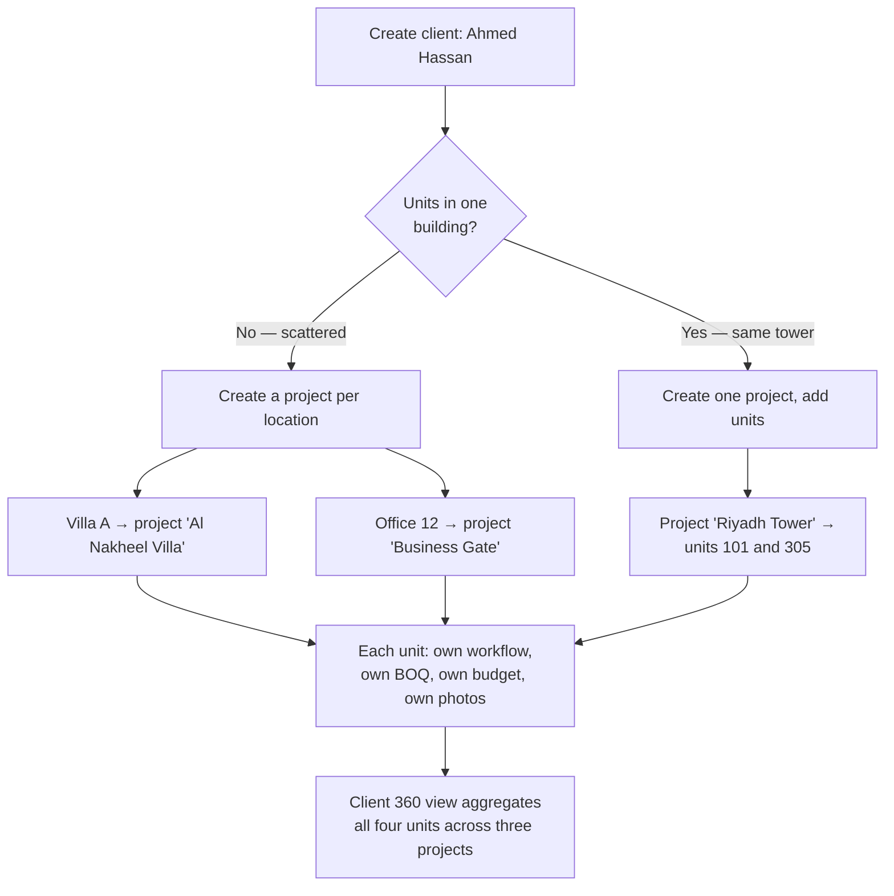
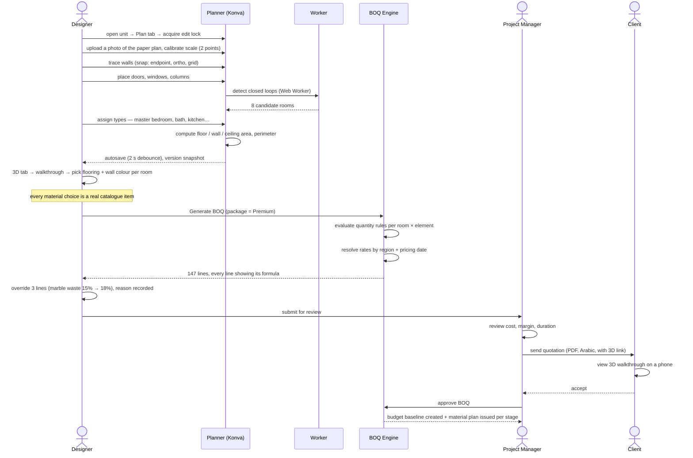
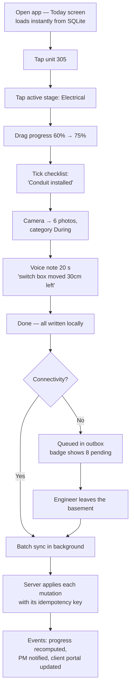
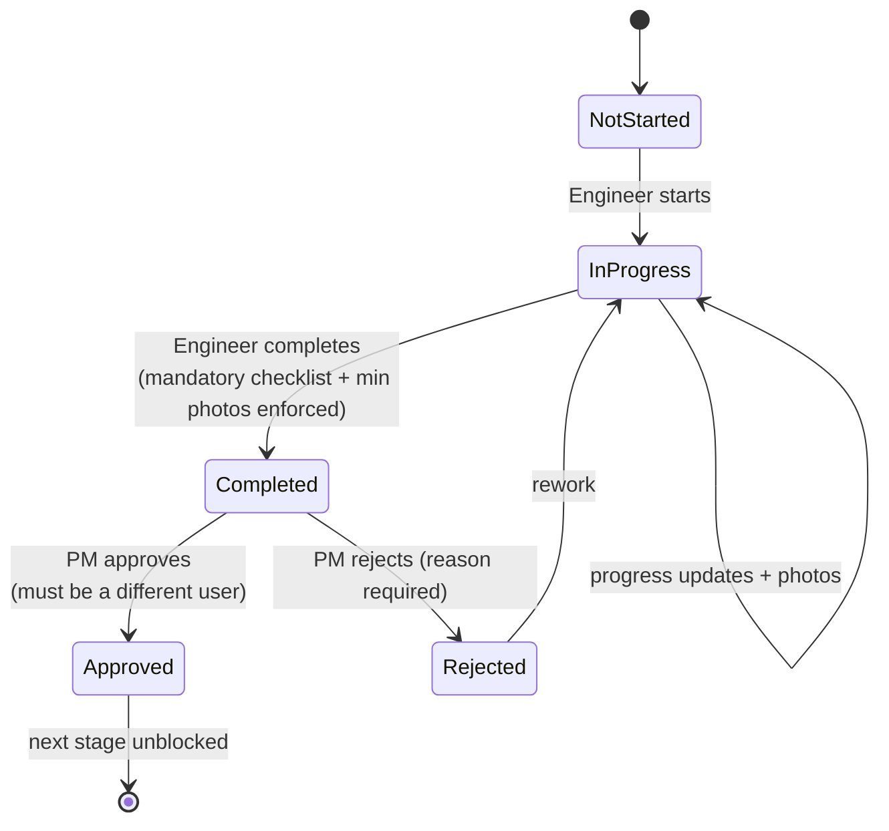
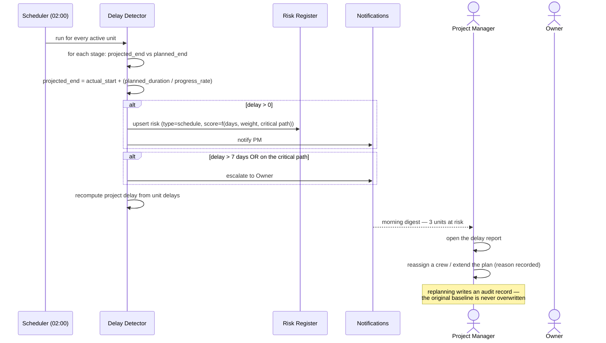
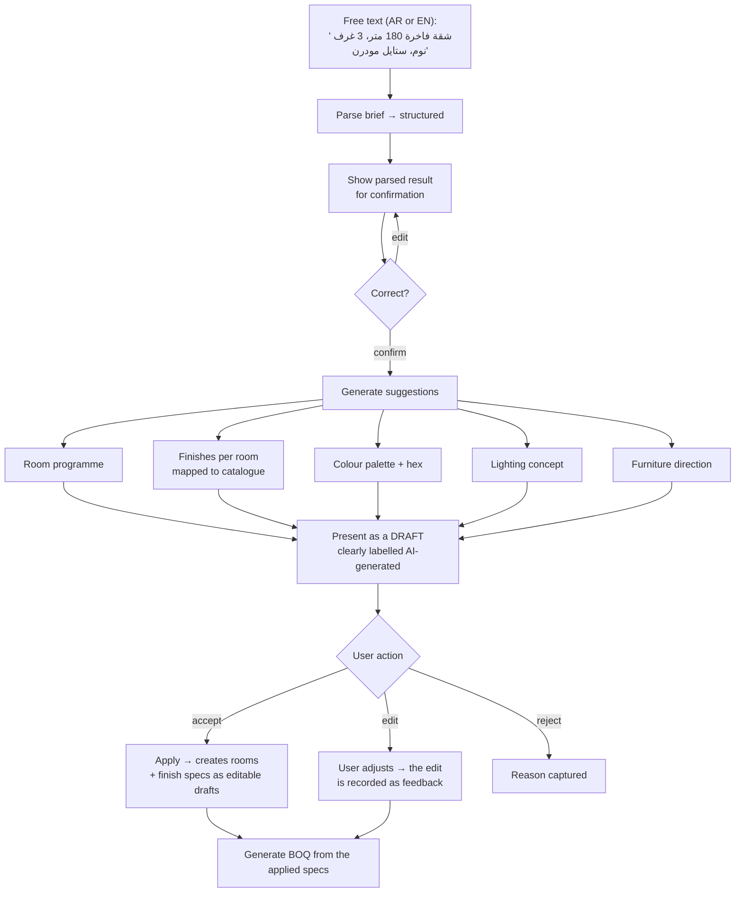

# 14 — User Flows

Each flow states the actor, the trigger, the steps, the system reactions, and the failure paths.
These are the flows the E2E suite implements.

---

## 1. Flow map



---

## 2. Flow A — Company onboarding

**Actor:** Company Owner · **Trigger:** Signup · **Goal:** productive within one working day

| # | Step | System |
|---|---|---|
| 1 | Sign up: company name, country, email, mobile, password | Validates, sends OTP |
| 2 | Verify OTP | Creates `Company` + owner `User` + trial `Subscription` |
| 3 | Regional setup wizard: currency, measurement, language, **week start/weekend**, tax rate | Pre-filled from country; every field editable |
| 4 | Choose a starting point | **(a)** Seed demo tenant, **(b)** import from Excel, **(c)** start empty |
| 5 | Seed catalogue | Regional material catalogue + rate card copied in |
| 6 | Default workflow | 14-stage template installed, editable |
| 7 | Default packages | Economic/Standard/Premium/Luxury seeded with regional materials |
| 8 | Invite team | Bulk invite by email/mobile with role assignment |
| 9 | Create the first project | Guided, with inline help |

**Design note.** Step 5 is the highest-leverage decision in the whole onboarding. A tenant facing
an empty material catalogue cannot generate a BOQ, so they cannot experience the product's core
value, so they churn during trial. Seeding a real regional catalogue (≈ 800 items with realistic
prices per country) is what converts trials.

**Failure paths:** email already registered → offer login or company chooser · OTP expired →
resend with a rate limit · country unsupported → allow signup with manual regional config and
flag for product.

---

## 3. Flow B — Client with multiple units

**Actor:** Project Manager · **Goal:** model Ahmed Hassan's four units correctly



**Steps**

1. `Clients → New`. Enter name (AR + EN), mobile, national ID. Duplicate check warns on an
   existing mobile.
2. `Client → Units` tab shows all owned units regardless of project.
3. Creating a unit inside a project sets `owner_client_id` — by default the project's client, but
   overridable. This is the mechanism that lets a developer's tower project contain units owned
   by twelve different end clients.
4. The client 360 view shows: 4 units · combined progress · combined budget vs. actual · next
   milestones · all documents.

**Why this matters:** a developer builds a 200-unit tower and sells units to individual buyers.
The project belongs to the developer; the units belong to the buyers. Any model that forces
`unit.client = project.client` cannot represent this, and that model failure would exclude the
highest-value customer segment.

---

## 4. Flow C — Floor plan to BOQ (the core value chain)

**Actor:** Interior Designer → Project Manager · **Duration:** ~45 minutes for a 180 m² apartment



**The moment the product proves itself:** the client opens the 3D link on their phone, walks
through their own apartment with the actual tiles they are being quoted for, and accepts. No
competitor in the SMB finishing segment in this region offers that.

**Failure paths:** plan lock held by another user → read-only with "request access" · room
detection finds an unclosed loop → highlight the gap on canvas with a "close wall" action ·
material missing from the catalogue → inline "add material" without leaving the BOQ · rate card
missing for the region → warn, fall back to the material default cost, mark the BOQ low
confidence.

---

## 5. Flow D — The site engineer's daily loop (mobile, offline)

**Actor:** Site Engineer · **Context:** basement of a red-brick tower, no signal · **Target:** ≤ 90 s



**What the engineer never sees:** a spinner, a sync error dialog, a "no connection" block, or a
lost photo. Everything writes locally and reconciles later.

**Failure paths:** stale version (the PM changed the stage) → last-writer-wins on progress, with
the superseded value shown in history · illegal transition (the PM already rejected the stage) →
conflict card with both states and a plain-language choice · storage full → warn at 80 %, offer
"sync now", never auto-delete unsynced originals.

---

## 6. Flow E — Material lifecycle

**Actors:** Procurement Officer, Site Engineer, Accountant

```mermaid
flowchart LR
    A[BOQ approved] --> B[Material plan issued<br/>planned qty per stage]
    B --> C{Stage approaching}
    C --> D[System: shortage alert<br/>planned > remaining]
    D --> E[Purchase request created]
    E --> F{Above approval<br/>threshold?}
    F -->|yes| G[Owner approves]
    F -->|no| H[Auto-approved]
    G & H --> I[Purchase order to supplier]
    I --> J[Goods received on site]
    J --> K[Movement: purchase_receipt IN]
    K --> L[purchased += qty]
    L --> M[Engineer records consumption]
    M --> N[Movement: consumption OUT]
    N --> O[used += qty · remaining = purchased − used]
    O --> P{Variance vs plan?}
    P -->|used > planned ×1.1| Q[Waste alert to PM]
    P -->|within tolerance| R[Normal]
    J --> S[Invoice uploaded + OCR]
    S --> T[Allocated to unit + stage]
    T --> U[actual_cost updated]
    U --> V{Over budget?}
    V -->|yes| W[Alert owner + accountant]
```



**Worked example — porcelain tiles, unit 305:**

| Event | Movement | Planned | Purchased | Used | Remaining |
|---|---|---|---|---|---|
| BOQ approved | — | 52.0 m² | 0 | 0 | 0 |
| 40 boxes received (1.44 m²/box) | `purchase_receipt` +57.6 | 52.0 | 57.6 | 0 | 57.6 |
| Bedrooms tiled | `consumption` −31.2 | 52.0 | 57.6 | 31.2 | 26.4 |
| Living room tiled | `consumption` −18.4 | 52.0 | 57.6 | 49.6 | 8.0 |
| Breakage | `wastage` −2.9 | 52.0 | 57.6 | 52.5 | 5.1 |
| Surplus returned | `return_to_supplier` −5.1 | 52.0 | 57.6 | 52.5 | 0 |

Final variance: used 52.5 vs. planned 52.0 — **+1 %**, well within the 10 % waste factor already
priced in. Every number above is reconstructible from the ledger, with an actor and a timestamp
on each row. That is the difference between "we think tiles were fine" and "tiles were fine, and
here is the proof."

---

## 7. Flow F — Stage approval with segregation of duty



**Rules in play**

1. Completion is blocked while a mandatory checklist item is unchecked.
2. Stages configured with `requires_photos` block completion below the minimum photo count —
   evidence is not optional.
3. The approver must differ from the completer, unless the tenant explicitly disables the rule
   (a two-person company legitimately needs to).
4. Rejection requires a reason, which is pushed to the engineer and recorded in the audit log.
5. Approval publishes `StageApproved` → next-stage material readiness check → notify the assigned
   crew → recompute progress → update the client portal.
6. Client approval on the final delivery stage is optional and tenant-configurable.

---

## 8. Flow G — Client portal

**Actor:** Client · **Device:** mobile browser · **Goal:** stop phoning the contractor

| Screen | Content |
|---|---|
| My units | Card per owned unit: progress ring, current stage, expected completion |
| Unit progress | Stage timeline with status and dates, delay flagged honestly |
| Photo gallery | Before/during/after per stage, before/after comparison slider |
| 3D view | Interactive walkthrough of their own finish selections |
| Documents | Contract, quotation, BOQ, warranty — only what is marked `client_visible` |
| Payments | Milestone schedule, invoices, paid/outstanding |
| Approvals | Any stage awaiting client sign-off |
| Messages | Threaded comments to the project team |

**Design constraints:** no internal cost data ever (only the client's own contracted amounts) ·
no other clients' units, ever · no internal notes or team discussion · read-mostly, with a small
set of explicit actions · loads in under 2 s on 4G.

**The commercial insight:** this portal is what the contractor demos to *their* client to win
work. It is a sales tool for the customer, which makes it a retention tool for BuildFlow.

---

## 9. Flow H — Delay detection and escalation



**Detection rules**

| Signal | Threshold |
|---|---|
| Stage past planned end, not complete | Immediate |
| Stage at 0 % for N days after planned start | N = 3 (configurable) |
| Progress rate implies overrun | Projected end > planned end |
| Blocked stage | Blocked > 2 days |
| Predecessor incomplete while successor started | Warning only — real sites overlap |
| Unapproved completed stage | > 3 days awaiting approval |

**Baselines are never overwritten.** Replanning creates a new planned schedule while the original
baseline is retained, so "we finished on time" can be checked against what was actually promised.

---

## 10. Flow I — AI design assistant

**Actor:** Interior Designer / Sales



**Guarantees at every step:** the AI never writes directly to the domain · every suggested
material resolves to a real catalogue item (hallucinated products are dropped before display) ·
accept/edit/reject is recorded as training signal · if the provider fails, the flow degrades to
package-based defaults with a clear message.

---

## 11. Flow J — Handover

**Actors:** PM, Engineer, Client

| # | Step | Gate |
|---|---|---|
| 1 | All stages approved | Hard gate |
| 2 | Snag inspection walkthrough (mobile) | Snags raised with photos |
| 3 | Snags assigned and rectified | Each closed with an "after" photo |
| 4 | Client inspection | Client may raise additional snags via the portal |
| 5 | All snags verified closed | Hard gate |
| 6 | Handover documents assembled | Warranty, as-built plan, material schedule, maintenance guide |
| 7 | Client signs the handover certificate | Digital signature or uploaded scan |
| 8 | Unit → `delivered` | Emits `UnitDelivered` |
| 9 | Final invoice + retention schedule | Retention release dated per contract |
| 10 | **Profitability report generated** | Contract value − actual cost = margin, per unit |

Step 10 is where the owner finds out whether the job made money — and, crucially, *why*: which
stage overran, which material was over-consumed, which supplier was over-priced. That report is
the reason the owner keeps paying the subscription after the novelty of the 3D viewer wears off.

---

## 12. Flow K — Cloning identical units

**Actor:** PM · **Context:** 12 identical apartments in one tower

```
Unit 101 fully configured (rooms, plan, package, BOQ, workflow)
  → Clone → select targets: 201, 301, 401, 501… (or "create N units")
  → choose what to copy: ☑ rooms ☑ floor plan ☑ finish specs ☑ BOQ ☑ workflow ☐ photos ☐ costs
  → per-unit overrides: unit number, floor, owner client
  → background job creates 11 units
  → each gets its OWN workflow instance, BOQ version, budget, and material plan
```

**Critical:** cloning copies *configuration*, never *execution state*. Progress, photos, costs,
and stock movements are always unit-specific. A clone that copied progress would corrupt every
downstream number in the system.

The AI/BOQ cache makes this cheap: twelve identical units generate **one** rule evaluation and
**one** AI call, reused twelve times.

---

## 13. Flow L — Permission scoping in practice

**Scenario:** Khaled is a site engineer assigned to Project A only.

| Action | Result | Enforcement |
|---|---|---|
| Open the units list | Sees Project A units only | ABAC scope filter in the query |
| Open a Project B unit by direct URL | **404**, not 403 | Cross-scope IDs are indistinguishable from non-existent |
| View a unit's materials | Sees quantities | `material.view` |
| View the same unit's costs | Cost columns absent from the response entirely | Field-level authorization at the presenter |
| Complete a stage | Allowed | `stage.complete` + assignment |
| Approve a stage | Button hidden; API returns 403 | `stage.approve` not held |
| Export the client list | Blocked | `client.export` not held |
| Get reassigned to Project B | Sees Project B within 60 s | Permission cache TTL; no logout needed |

The 404-not-403 rule appears in every flow because it is the one that prevents an authorization
control from becoming an information-disclosure channel.
