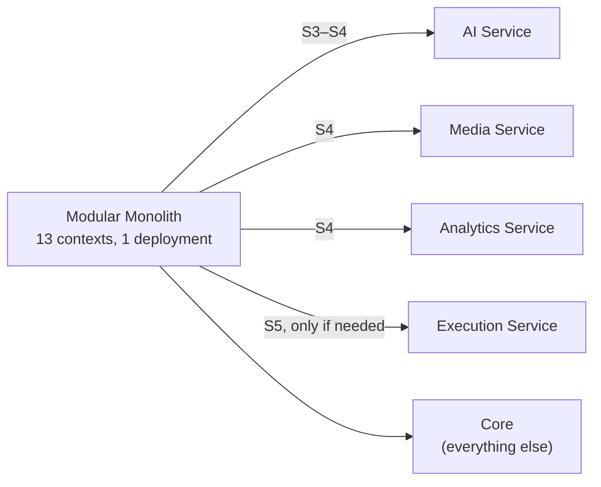

# 17 — Scalability & Future Growth Plan

The system launches on a single server. Every decision below exists so that growing to hundreds
of tenants and millions of records is a **sequence of independent, reversible steps** — never a
rewrite.

---

## 1. Growth stages

| Stage | Tenants | Units | Concurrent users | Photos | DB size | Topology |
|---|---|---|---|---|---|---|
| **S1** Launch | 1–50 | 2,000 | 30 | 700 K | 15 GB | Single server, Docker Compose |
| **S2** Traction | 50–200 | 15,000 | 120 | 5 M | 120 GB | Managed DB + Redis, 2–4 API nodes, CDN |
| **S3** Scale | 200–500 | 50,000 | 400 | 18 M | 500 GB | Read replica, partitioning, OpenSearch, worker pools |
| **S4** Multi-region | 500–2,000 | 250,000 | 1,500 | 90 M | 2.5 TB | Region-pinned deployments, extracted services |
| **S5** Platform | 2,000+ | 1 M+ | 5,000+ | 400 M+ | 10 TB+ | Sharded tenants, event streaming, per-domain storage |

The requirement stated "thousands of projects, hundreds of concurrent users" — that is **S3**,
comfortably reachable without microservices, without sharding, and without a rewrite.

---

## 2. Bottleneck analysis

Ordered by when each actually becomes a problem.

| # | Bottleneck | Appears at | Symptom | Response | Cost |
|---|---|---|---|---|---|
| 1 | Photo storage & bandwidth | **S1** | Storage bill, slow galleries | Object storage from day one, WebP variants, CDN, lifecycle tiering | Designed in |
| 2 | Dashboard aggregation queries | S2 | Slow home screens | Cache (60 s) → projection tables maintained by events | 1–2 weeks |
| 3 | Report generation | S2 | Request timeouts | Async jobs + notification (already the design) | Designed in |
| 4 | MySQL write contention on hot tables | S3 | Lock waits on `unit_stages` | Small aggregates, short transactions, optimistic concurrency | Designed in |
| 5 | Read load from analytics | S3 | Primary CPU saturation | Read replica; query handlers take a different connection | 1 week |
| 6 | `audit_logs` / `progress_snapshots` growth | S3 | Slow inserts, huge tables | Monthly range partitions + partition drop on retention | Designed in |
| 7 | Full-text search | S3 | Slow catalogue and document search | Extract to OpenSearch behind the existing search port | 2–3 weeks |
| 8 | Worker queue contention | S3 | Notification delay behind AI jobs | Already separate queues; scale pools independently | Designed in |
| 9 | Redis memory | S4 | Eviction, cache misses | Sentinel → Cluster, tiered TTLs | 1 week |
| 10 | Single-database ceiling | S4–S5 | Vertical limit reached | Tenant sharding by `company_id` (the routing indirection already exists) | 4–6 weeks |
| 11 | Node.js CPU on image/PDF work | S2 | API latency spikes | Already off the request path in workers | Designed in |
| 12 | Cross-region latency | S4 | Slow for distant tenants | Region-pinned deployment + tenant directory | 3–4 weeks |

**Nine of twelve are either designed in from day one or cost under two weeks.** That is the
return on the Phase 0 investment.

---

## 3. Stage-by-stage evolution

### S1 → S2 (50 → 200 tenants)

| Change | Effort |
|---|---|
| Managed MySQL with automated backups + PITR | 2 days |
| Managed Redis | 1 day |
| Object storage → S3 + CloudFront | 2 days |
| API containerised behind a load balancer, 2–4 instances | 3 days |
| Worker pools split by queue class | 2 days |
| Dashboard caching (60 s TTL) | 3 days |
| Monitoring dashboards + alerting thresholds | 1 week |

**No application code changes** beyond configuration and the caching layer. The API is already
stateless, sessions already live in Redis, and files are already in object storage.

### S2 → S3 (200 → 500 tenants)

| Change | Effort |
|---|---|
| Read replica; `ReadDatabase` injected into query handlers | 1 week |
| Projection tables for dashboards, maintained by event handlers | 2–3 weeks |
| Partition `audit_logs`, `progress_snapshots`, `stock_movements` | 1 week |
| OpenSearch behind the existing `SearchPort` | 2–3 weeks |
| Per-tenant queue concurrency caps | 3 days |
| Archive delivered units older than 2 years to cold tables | 1 week |

The CQRS split done in Phase 0 is what makes the replica change a dependency-injection edit
rather than a refactor of every query.

### S3 → S4 (500 → 2,000 tenants)

| Change | Effort |
|---|---|
| Extract **AI Services** to its own deployment | 2 weeks |
| Extract **Media/Documents** processing | 3 weeks |
| Extract **Analytics** with its own store | 4 weeks |
| Redis Cluster | 1 week |
| Region-pinned deployments + tenant directory | 3–4 weeks |
| Dedicated databases for Enterprise tenants | 2 weeks (routing already exists) |

### S4 → S5

Tenant sharding: `company_id → shard` in the tenant directory; the connection registry already
returns a per-tenant client, so application code is unchanged. Event streaming (Kafka/Redpanda)
replaces Redis Streams for cross-service events. Per-domain storage engines where justified
(time-series for progress trends, a graph store if relationship queries ever demand it).

---

## 4. Service extraction order and rationale

| # | Service | Why first | Coupling |
|---|---|---|---|
| 1 | **AI** | Different scaling profile (bursty, latency-tolerant), different cost model, independent release cadence, third-party dependency | Already behind a port with an ACL. Extraction ≈ swapping a local adapter for an HTTP adapter |
| 2 | **Media/Documents** | CPU-bound image and PDF work with a completely different resource shape; benefits from spot instances | Communicates only via events + object storage |
| 3 | **Analytics** | Read-heavy, different storage engine, no write coupling | Already event-driven and owns no write model |
| 4 | Execution / Procurement | Only if a single context genuinely dominates load | Deferred indefinitely — probably never needed |

**What makes extraction cheap:** modules already communicate through published contracts and
events, never through direct table access. Analytics already never joins another context's
tables. The AI context already sits behind a port. The extraction work is transport plumbing,
not domain surgery.

---

## 5. Database scaling

### 5.1 Vertical first, and for longer than instinct suggests

A modern managed MySQL instance (16 vCPU, 64 GB RAM, NVMe) comfortably handles ~500 GB and
several thousand transactions per second for this workload. Vertical scaling is *dramatically*
cheaper than the engineering cost of sharding, and it buys years.

### 5.2 The optimisation ladder

| Step | When |
|---|---|
| Index tuning (`EXPLAIN` on every registered query) | Continuous |
| Query optimisation, eliminate N+1 | Continuous |
| Connection pooling tuned to `max_connections` | S1 |
| Caching layer | S2 |
| Read replica | S3 |
| Partitioning of append-heavy tables | S3 |
| Archiving cold data | S3 |
| Vertical scale-up | S3–S4 |
| Tenant sharding | S5 |

### 5.3 Partitioning

| Table | Scheme | Retention |
|---|---|---|
| `audit_logs` | RANGE by month on `occurred_at` | 7 years; cold-archive after 1 |
| `progress_snapshots` | RANGE by month | 3 years |
| `stock_movements` | RANGE by year | Forever (archived) |
| `ai_requests` | RANGE by month | 12 months |
| `login_attempts` | RANGE by month | 90 days |

Maintenance runs with a 3-month look-ahead. `DROP PARTITION` is instant; `DELETE` of 400 million
rows is a weekend-long incident.

### 5.4 Sharding design (S5, pre-planned)

- **Shard key: `company_id`.** Every table already carries it, and no query in the system
  legitimately spans tenants.
- Tenant directory maps `company_id → shard`; the connection registry already returns a
  per-tenant client, so application code needs no change.
- Cross-shard analytics runs against a separate warehouse fed by events — never a cross-shard
  join.
- Rebalancing is a per-tenant migration with a brief read-only window, which is acceptable and
  schedulable because the unit of movement is one customer.

**The critical property: a tenant's data never spans shards.** That is what keeps sharding an
operational task rather than a distributed-transactions problem.

---

## 6. Caching strategy by stage

| Stage | Layers |
|---|---|
| S1 | Application-level (Redis) for permissions and settings; HTTP `ETag` for reference data |
| S2 | + Dashboard aggregate caching, CDN for all static and media |
| S3 | + Projection tables (materialised reads), query-result caching with event invalidation |
| S4 | + Regional edge caching, per-region Redis |
| S5 | + Multi-tier (in-process LRU → Redis → projection) with coherence protocol |

Invalidation is **event-driven, not TTL-guessed**. `MaterialPriceChanged` invalidates catalogue
and package-price caches immediately; a 5-minute TTL that shows a stale price on a quotation is
a commercial error, not a performance trade-off.

---

## 7. Frontend & mobile scaling

| Concern | Approach |
|---|---|
| Bundle growth | Route-level splitting, per-app bundles, `size-limit` in CI |
| Long lists | Virtualised rendering; keyset pagination; never load 5,000 rows |
| Image bandwidth | Responsive `srcset` from CDN variants — a phone fetches 320 px, not 1920 px |
| Realtime fan-out | Redis pub/sub adapter; room-scoped subscriptions; polling fallback |
| Mobile sync volume | Delta sync with cursors; batch mutations; per-entity cursors so one large table never blocks the rest |
| Mobile local storage | LRU eviction of synced media; unsynced data never evicted |
| Offline dataset size | Only *assigned* units sync — a 200-unit tower does not land on every engineer's phone |

---

## 8. Cost model

| Stage | Compute | Database | Redis | Storage + CDN | AI | **Monthly** | Per tenant |
|---|---|---|---|---|---|---|---|
| S1 (50) | $60 | incl. | incl. | $40 | $50 | **≈ $150** | $3.00 |
| S2 (200) | $320 | $280 | $90 | $260 | $200 | **≈ $1,150** | $5.75 |
| S3 (500) | $850 | $900 | $200 | $1,100 | $500 | **≈ $3,550** | $7.10 |
| S4 (2,000) | $3,200 | $3,600 | $700 | $5,200 | $1,800 | **≈ $14,500** | $7.25 |

Infrastructure cost per tenant **flattens around $7** and does not grow with scale — the profile
of a healthy SaaS business. Storage is the dominant and fastest-growing line, which is precisely
why compression, WebP variants, lifecycle tiering, deduplication, and per-plan quotas are
architectural decisions rather than later optimisations.

**Gross margin at S3:** at an average $180/month subscription across 500 tenants ($90 K MRR)
against $3.5 K infrastructure, infrastructure is under 4 % of revenue.

---

## 9. Performance budgets by stage

| Metric | S1 | S3 | S5 |
|---|---|---|---|
| API p95 (read) | 250 ms | 300 ms | 350 ms |
| API p95 (write) | 400 ms | 600 ms | 700 ms |
| Dashboard load | 1.2 s | 1.5 s | 1.8 s |
| BOQ generation (250 m²) | 3 s | 5 s | 5 s |
| Photo upload ack | 500 ms | 500 ms | 500 ms |
| Mobile sync (40 mutations) | 3 s | 5 s | 6 s |
| Search | 200 ms | 300 ms | 300 ms |

Budgets are deliberately allowed to degrade slightly with scale. Holding S1 latency at S5 volume
would cost far more than it is worth to users who cannot perceive 100 ms.

---

## 10. Organisational scaling

Architecture and team structure track each other (Conway's Law works in both directions — use it
deliberately).

| Team size | Structure | Architecture fit |
|---|---|---|
| 4–8 | One team, whole codebase | Modular monolith |
| 8–15 | Feature teams with module ownership | Module boundaries become team boundaries |
| 15–30 | Domain teams (Field, Commercial, Platform) | First service extractions align to teams |
| 30+ | Platform team + domain teams | Services with clear ownership and on-call |

**Module ownership from day one** — even at 4 people. Naming an owner per module means every
boundary has someone who defends it, and boundaries that nobody defends erode within a year.

---

## 11. Data growth projections

At S3 (500 tenants, 3 years):

| Table | Rows | Strategy |
|---|---|---|
| `audit_logs` | 400 M | Monthly partitions, 7-year retention, cold archive at 1 year |
| `photos` | 90 M | Metadata only in MySQL; bytes in tiered object storage |
| `stock_movements` | 60 M | Yearly partitions, never deleted |
| `boq_lines` | 40 M | Archive superseded BOQ versions |
| `progress_snapshots` | 200 M | Monthly partitions, 3-year retention |
| `unit_stages` | 7 M | Archive delivered units older than 2 years |

Storage: ≈ 500 GB relational + ≈ 14 TB object (3 TB hot, 11 TB archived).

---

## 12. What would force a rewrite — and why none of it applies

| Scenario | Why it does not apply here |
|---|---|
| Tenant isolation retrofitted late | Enforced in three layers from Phase 0 |
| Business logic trapped in controllers | Architecture tests prevent it from ever getting there |
| No event history for analytics | Outbox + immutable ledgers from day one |
| Money as floats | `DECIMAL` + `bigint` minor units from day one |
| No audit trail | Written in-transaction from day one |
| Hardcoded English strings | Lint rule from commit one |
| Sequential IDs blocking offline and sharding | UUIDv7 from day one |
| Mutable stock counters | Immutable movement ledger from day one |
| Files in the database | Object storage from day one |
| Cross-module table access | Published contracts enforced by CI |

Every item on that list is a decision that is nearly free on day one and nearly impossible on day
one thousand. That is the entire justification for Phase 0.

---

## 13. Ten-year outlook

| Horizon | Direction |
|---|---|
| Years 1–2 | Own the GCC finishing-contractor segment; depth over breadth |
| Years 3–4 | Adjacent segments (fit-out contractors, developers, facilities management); public API and integration ecosystem |
| Years 5–7 | Marketplace connecting contractors, suppliers, and clients — viable only once transaction volume exists |
| Years 8–10 | Data network effects: benchmark rates, duration norms, and supplier reliability derived from aggregated, anonymised platform data — a dataset no competitor can replicate |

The long-term defensibility is not the 3D viewer, which any competitor can build. It is the
accumulated, structured record of what things actually cost and how long they actually take,
across thousands of real units — which only exists because Phase 2 made the site engineer's
daily loop take 90 seconds instead of five minutes.
